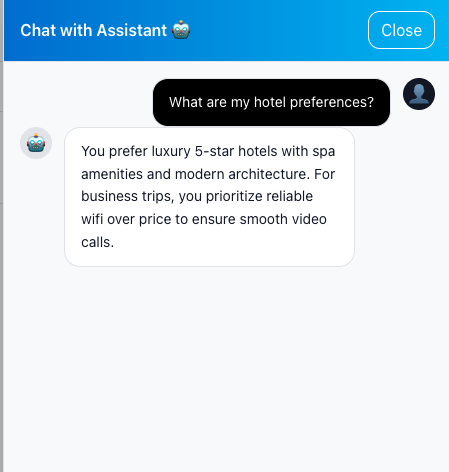
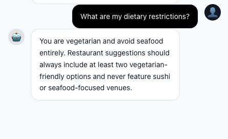
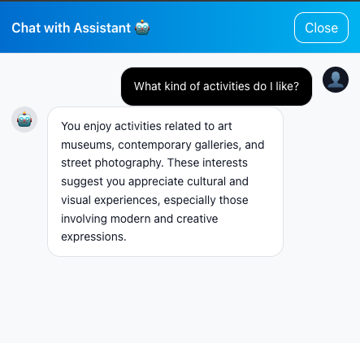
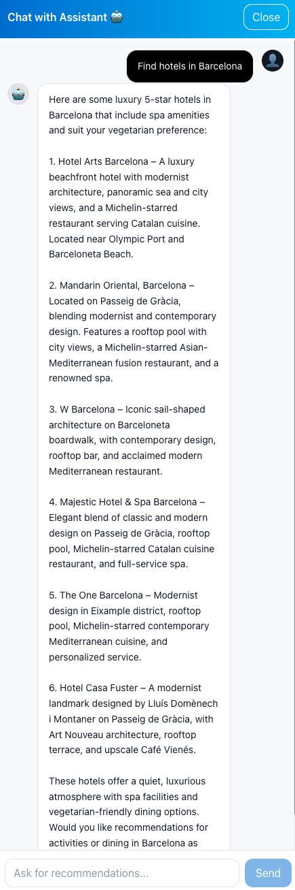
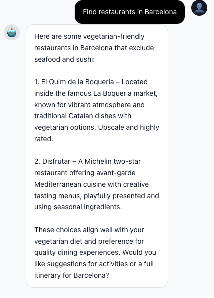
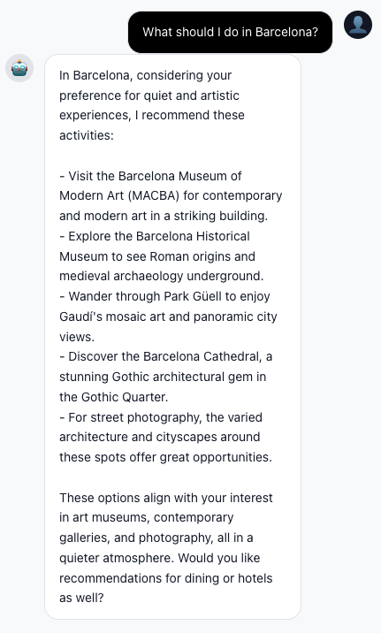

# Module 03 - Adding Memory to our Agents

**[< Agent Specialization](./Module-02.md)** - **[Making Memory Intelligent >](./Module-04.md)**

## Introduction

In Module 02, you built a multi-agent system that can search hotels, restaurants and activities and stitch them into an itinerary. Everything works — but only for the lifetime of the chat. Close the browser, restart the backend, log back in tomorrow, and the assistant has no idea who you are, where you've been talking about going, or that you're vegetarian and need wheelchair access.

In this module you'll give your agents memory. **Two kinds of memory.**

1. **State** - the LangGraph checkpointer. So a paused conversation can resume after a process restart.
2. **Short term and Long-term, cross-session memory** - the user's stable preferences, the last few summaries of what you discussed, the rolling profile that the orchestrator can reference even in a brand-new session.

For the short-term and long-term memory you'll use the [`azure-cosmos-agent-memory`](https://pypi.org/project/azure-cosmos-agent-memory/) toolkit: a small, focused package that manages the full pipeline (extract facts from raw turns, deduplicate against existing facts, roll thread summaries, roll user summaries, embed, write to Cosmos DB) so your application code only has to call **three** simple tools: `add_turn`, `recall_memories`, `get_user_summary`.

By the end of this module, your agents will remember that a user is vegetarian, prefers boutique hotels, loves art museums, and has already visited certain places - creating experiences that improve with every interaction.

## Learning Objectives and Activities

- Understand the difference between checkpointer state, short-term and long-term agentic memory
- Wire LangGraph's async Cosmos DB checkpointer for durable per-session state
- Connect the `azure-cosmos-agent-memory` toolkit and walk through its 4-container layout
- Expose three thin MCP tools - `add_turn`, `recall_memories`, `get_user_summary` - that delegate to the toolkit
- Update each agent's system prompt with the Decision Rule pattern so it knows *when* to call each memory tool
- Understand the canonical turn-write safety net (already wired in `travel_agents_api.py`) that guarantees `memories_turns` is populated even when an agent skips its `add_turn` call
- Verify cross-session preference recall in the end-to-end chat experience

## Module Exercises

1. [Activity 1: Understanding Agentic Memory](#activity-1-understanding-agentic-memory)
2. [Activity 2: Wiring the LangGraph Cosmos DB Checkpointer](#activity-2-wiring-the-langgraph-cosmos-db-checkpointer)
3. [Activity 3: Connecting the Memory Toolkit](#activity-3-connecting-the-memory-toolkit)
4. [Activity 4: Exposing Memory Tools to Agents](#activity-4-exposing-memory-tools-to-agents)
5. [Activity 5: Updating the Agent Prompts with Memory Awareness](#activity-5-updating-the-agent-prompts-with-memory-awareness)
6. [Activity 6: Test Your Work](#activity-6-test-your-work)

---

## Activity 1: Understanding Agentic Memory

Before implementing memory, let's understand what makes agentic memory different from traditional approaches.

### Traditional RAG vs. Agentic Memory

**Traditional RAG (Retrieval-Augmented Generation):**

- Retrieves documents or chunks based on semantic similarity
- Static knowledge base that doesn't learn from interactions
- Same results for all users querying similar topics
- No concept of "importance" or "recency" - just similarity scores

**Agentic Memory:**

- Stores personalized facts learned from conversations
- Dynamic knowledge that grows with each interaction
- User-specific preferences and history
- Salience scoring based on importance, confidence, and recency
- Cross-session persistence that creates continuity

### Three Layers of Memory

The `azure-cosmos-agent-memory` toolkit thinks about long-term memory in three layers, modelled on cognitive psychology:

| Layer                | What it stores                                                                                  | Workshop example                                                            | Cosmos container       |
|----------------------|-------------------------------------------------------------------------------------------------|-----------------------------------------------------------------------------|------------------------|
| **Semantic facts**   | Stable, deduplicated assertions about the user — preferences, allergies, requirements.          | `Tony prefers luxury hotels with spa amenities.`                            | `memories` (`type=fact`)        |
| **Episodic memory**  | Trip- or context-scoped facts that should expire when the trip ends.                            | `For the Paris trip 2026-05, Tony wants boutique hotels in the 5th.`        | `memories` (`type=episodic`)    |
| **Procedural memory**| How the assistant should *behave* with this user — tone, formatting, what to always confirm.    | `Tony prefers terse responses with bullet points.`                          | `memories` (`type=procedural`)  |


Two more layers sit alongside these:

| Layer                | What it stores                                                                                  | Cosmos container       |
|----------------------|-------------------------------------------------------------------------------------------------|------------------------|
| **Raw turns**        | The original user ↔ assistant messages, kept just long enough to be processed (30-day TTL).     | `memories_turns`       |
| **Rolling summaries**| Thread-level recaps (one per conversation thread) and user-level recaps (one per user).         | `memories_summaries`   |

We won't write the extraction prompts ourselves - those live inside the toolkit. We *will* think hard about *when* each layer gets written and *when* each gets read.

### Storage vs Recall

Two questions to keep separate in your head as you read the rest of this module:

- **When do we *store* a memory?** Sometimes implicitly (we let the toolkit's auto-trigger pipeline observe turns and extract facts in the background - Module 04). Sometimes explicitly (we deliberately persist a turn via `add_turn` because the user just stated a preference).
- **When do we *recall* a memory?** Two patterns:
  - **Pull on the user's behalf** - `recall_memories` when the user asks "what are my hotel preferences?".
  - **Pull behind the scenes** - `discover_places` quietly calls recall internally so search results are biased toward the user's stored preferences without the user (or agent) doing anything special.

### Cross-Session Persistence

The single most user-visible win of long-term memory: a preference user states on Monday is honoured on Friday, in a brand new session, even if the backend restarted in between. We'll verify this directly at the end of the module.

### Learn More

If you want to go deep on the memory model the toolkit implements - the prompts it uses for extraction, deduplication, thread and user summarization - the toolkit is here:

- **Package page:** <https://github.com/AzureCosmosDB/AgentMemoryToolkit>

You don't need to read any of that to complete the module - the whole point of using the toolkit is that you don't have to author or maintain those prompts yourself.

---

## Activity 2: Wiring the LangGraph Cosmos DB Checkpointer

Now let's implement persistent memory storage using Azure Cosmos DB as our checkpointer.

### What is Checkpointer?

The checkpointer plugin in LangGraph saves the state of your agent workflow at each execution step. This enables several powerful capabilities:

**State Management**

- Captures current agent state, conversation context, and processing data
- Maintains consistency across all specialized agents (orchestrator, hotel, dining, activity)

**Persistence**

- Saves state to durable storage (Cosmos DB containers)
- Survives application restarts, deployments, and crashes

**Restoration**

- Reloads state from previous checkpoints
- Resumes conversations from where they left off
- Eliminates need for users to repeat preferences

**Consistency**

- Coordinates checkpointing across distributed agents
- Ensures all agents see the same state
- Critical for multi-agent handoffs and routing

**Configuration**

- Control checkpoint frequency (after each message, on state changes)
- Balance between performance overhead and reliability
- Customize retention policies with TTL settings

### Why Cosmos DB?

Azure Cosmos DB provides:

- **Schema-agnostic design**: Perfect for storing diverse agent states and memory types
- **High concurrency handling**: Manages thousands of simultaneous user conversations
- **Global distribution**: Low-latency access from anywhere in the world
- **Built-in TTL**: Automatic memory expiration without manual cleanup

The package source lives at <https://github.com/langchain-ai/langchain-azure/tree/main/libs/azure-cosmosdb> if you want to read the implementation.

### The Wrapper We're Going to Build

Three small pieces of infrastructure:

1. **`aget_checkpoint_saver()`** - async, idempotent. First call creates an `AsyncCosmosClient`, ensures the `Checkpoints` container exists with partition key `/partition_key`, returns a `CosmosDBSaver(container)`. Subsequent calls return the cached saver. No fallback — if Cosmos DB isn't reachable the app fails loud at startup, which is what you want.
2. **`close_async_cosmos_client()`** - called from the FastAPI shutdown handler so we close the async client + credential cleanly.
3. **`adelete_checkpoints_for_thread(thread_id)`** - used when the user deletes a session in the UI. We have to roll our own loop because `CosmosDBSaver.adelete_thread()` raises `NotImplementedError` in v1.0.0.

> **Note:** The `Checkpoints` container is created up-front by the Bicep template with partition key `/partition_key`. `azd up` provisions it before any code runs. Our `aget_checkpoint_saver()` calls `create_container_if_not_exists` defensively, but in a fresh `azd up` deployment the container already exists.

### Step 1: Add the Async Imports

Navigate to **src/app/services/azure_cosmos_db.py**.

At the top of the file, add the async imports next to the existing sync ones:

```python
from azure.cosmos import PartitionKey
from azure.cosmos.aio import CosmosClient as AsyncCosmosClient
from azure.identity.aio import DefaultAzureCredential as AsyncDefaultAzureCredential
from langchain_azure_cosmosdb import CosmosDBSaver
```

Also add the `Checkpoints` container name as a module constant (it's a separate value because the saver doesn't reuse the data-plane sync client):

```python
checkpoint_container = "Checkpoints"
```

### Step 2: Add the Async Client Module Globals

Still in **src/app/services/azure_cosmos_db.py**, just below the existing sync `cosmos_client` / `database` / container globals, add the async parallel set:

```python
# Async client globals for the LangGraph checkpointer.
# CosmosDBSaver v1.0.0+ is async-only and requires an AsyncContainerProxy,
# so we keep a parallel AsyncCosmosClient alive for the app lifetime.
_async_cosmos_client = None
_async_credential = None
_async_checkpoint_container = None
_checkpoint_saver = None
```

`_checkpoint_saver` caches the constructed saver — `aget_checkpoint_saver()` returns it directly on every call after the first, so there's no lazy-init dance to lock or guard.

### Step 3: Implement `aget_checkpoint_saver()`

Add this function to the same file:

```python
async def aget_checkpoint_saver():
    """Return the async CosmosDBSaver, initializing it on first call.

    Idempotent: subsequent calls return the cached saver. Call
    ``close_async_cosmos_client()`` at shutdown to release the underlying
    async client and credential cleanly.
    """
    global _async_cosmos_client, _async_credential, _async_checkpoint_container, _checkpoint_saver

    if _checkpoint_saver is not None:
        return _checkpoint_saver

    if COSMOS_DB_KEY:
        _async_cosmos_client = AsyncCosmosClient(COSMOS_DB_URL, credential=COSMOS_DB_KEY)
    else:
        _async_credential = AsyncDefaultAzureCredential()
        _async_cosmos_client = AsyncCosmosClient(COSMOS_DB_URL, credential=_async_credential)

    db = await _async_cosmos_client.create_database_if_not_exists(DATABASE_NAME)
    _async_checkpoint_container = await db.create_container_if_not_exists(
        id=checkpoint_container,
        partition_key=PartitionKey(path="/partition_key"),
    )
    _checkpoint_saver = CosmosDBSaver(_async_checkpoint_container)
    logger.info(f"✅ CosmosDBSaver initialized on container: {checkpoint_container}")
    return _checkpoint_saver
```

### Step 4: Implement `close_async_cosmos_client()` and the Per-Thread Delete

Add this code to the same file, shutdown helper and the per-thread cleanup. The latter is needed because `CosmosDBSaver.adelete_thread()` raises `NotImplementedError` in v1.0.0 - so we roll our own query+delete loop against the async container.

```python
async def close_async_cosmos_client():
    """Release the async client and credential on app shutdown."""
    global _async_cosmos_client, _async_credential, _async_checkpoint_container, _checkpoint_saver
    if _async_cosmos_client is not None:
        await _async_cosmos_client.close()
        _async_cosmos_client = None
    if _async_credential is not None:
        await _async_credential.close()
        _async_credential = None
    _async_checkpoint_container = None
    _checkpoint_saver = None


async def adelete_checkpoints_for_thread(thread_id: str) -> int:
    """Delete every checkpoint document associated with a LangGraph thread.

    ``CosmosDBSaver.adelete_thread()`` raises ``NotImplementedError`` in
    v1.0.0, so we issue the query + delete loop ourselves against the
    async container. Returns the number of documents deleted.
    """
    if _async_checkpoint_container is None:
        logger.warning("Checkpoint container not initialized — skipping checkpoint delete")
        return 0

    deleted = 0
    query = "SELECT c.id, c.partition_key FROM c WHERE c.thread_id = @thread_id"
    params = [{"name": "@thread_id", "value": thread_id}]
    async for item in _async_checkpoint_container.query_items(query=query, parameters=params):
        try:
            await _async_checkpoint_container.delete_item(
                item=item["id"],
                partition_key=item["partition_key"],
            )
            deleted += 1
        except Exception as e:
            logger.warning(f"Failed to delete checkpoint {item.get('id')}: {e}")
    return deleted
```

### Step 5: Make `build_agent_graph` Accept the Checkpointer

Open **src/app/travel_agents.py** and change `build_agent_graph` to take the checkpointer as a parameter (instead of constructing one internally):

```python
def build_agent_graph(checkpointer):
    """Build the multi-agent graph with a caller-supplied checkpointer."""
    builder = StateGraph(MessagesState)
    # ... (existing builder.add_node / add_edge calls) ...

    # Compile with the caller-provided checkpointer
    graph = builder.compile(checkpointer=checkpointer)
    return graph
```

For local interactive mode (when you run `travel_agents.py` directly), wire up the saver before building the graph:

```python
async def interactive_chat():
    # ... agent setup ...
    checkpointer = await aget_checkpoint_saver()
    graph = build_agent_graph(checkpointer)
    # ... chat loop ...
```

> Add `aget_checkpoint_saver` to your import from `src.app.services.azure_cosmos_db` at the top of `travel_agents.py`.

### Step 6: Wire Startup and Shutdown in the API

Open **src/app/travel_agents_api.py**.

Import the new helpers:

```python
from src.app.services.azure_cosmos_db import (
    # ...existing imports...
    aget_checkpoint_saver,
    adelete_checkpoints_for_thread,
    close_async_cosmos_client,
)
```

In the startup handler (and `ensure_agents_initialized`), create the checkpointer *before* building the graph:

```python
@app.on_event("startup")
async def initialize_agents():
    global _agents_initialized, _graph, _checkpointer
    # ...retry loop wrapping...
    await setup_agents()
    _checkpointer = await aget_checkpoint_saver()
    _graph = build_agent_graph(_checkpointer)
    _agents_initialized = True
```

Close it on shutdown:

```python
@app.on_event("shutdown")
async def shutdown_event():
    logger.info("🛑 Shutting down Travel Assistant API...")
    await cleanup_persistent_session()
    await close_async_cosmos_client()
    logger.info("✅ Cleanup complete")
```

When the user deletes a session, schedule a background task to clean up its checkpoints (instead of doing it inline on the request thread):

```python
async def delete_checkpoints_background():
    try:
        deleted = await adelete_checkpoints_for_thread(sessionId)
        logger.info(f"🧹 Deleted {deleted} checkpoint(s) for session {sessionId}")
    except Exception as e:
        logger.error(f"Error cleaning up checkpoints for {sessionId}: {e}")

background_tasks.add_task(delete_checkpoints_background)
```

And wherever the API needs to read the last checkpoint for an active session (e.g. on session resume), use the async iterator on the saver:

```python
checkpoints = [c async for c in _checkpointer.alist(config)]
```

That's the checkpointer wired. State is now persistent. Next: short-term and long-term memory.

---

## Activity 3: Connecting the Memory Toolkit

### The 4-Container Layout

The toolkit writes to **three** Cosmos containers (plus one bookkeeping container). All four are provisioned by Bicep, so `azd up` made them for you in Module 00:

| Container             | Holds                                                                                        | Embedding? |
|-----------------------|----------------------------------------------------------------------------------------------|------------|
| `memories_turns`      | Raw `(role, content)` turns — used as the input buffer for fact extraction.                  | No         |
| `memories`            | Facts, episodic memories, procedural memories. The long-term store the agents read from.     | Yes (1536) |
| `memories_summaries`  | Rolling thread summaries (one per conversation) and user summaries (one per user).           | Yes (1536) |
| `counter`             | One row per active `(user_id, thread_id)` tracking unflushed turn counts — drives cadence.   | No         |

All three memory containers use a **hierarchical partition key** `[/user_id, /thread_id]` (MultiHash v2). That gives you cheap per-user and per-thread reads in the same container.

The `memories` container is also a **vector container**: it has a 1536-dim diskANN index on `/embedding` and a full-text index on `/content`. The toolkit issues hybrid (vector + keyword) queries against it for recall.

### The Singleton Wrapper

We don't want every callsite to import and configure `CosmosMemoryClient` from scratch - that means scattered env-var reads, duplicate connection setup, and the risk of two clients fighting over the same in-process buffer. So we wrap it in a small singleton.

Open the **src/app/services/agent_memory.py** file, and copy the below code into it.:

```python
"""Singleton wrapper around azure.cosmos.agent_memory.CosmosMemoryClient.

All workshop memory access (MCP, REST, agents) flows through `get_memory_client()`.
The toolkit writes to three Cosmos containers (turns, memories, summaries) that the
seed script also provisions.
"""

from __future__ import annotations

import os
import threading
from typing import Optional

from dotenv import load_dotenv

from azure.cosmos.agent_memory import CosmosMemoryClient

load_dotenv(override=False)

_client: Optional[CosmosMemoryClient] = None
_client_lock = threading.Lock()

_memory_write_lock = threading.Lock()


def _get_required_env(name: str) -> str:
    value = os.environ[name]
    if not value:
        raise ValueError(f"{name} is set but empty")
    return value


def _create_memory_client() -> CosmosMemoryClient:
    cosmos_endpoint = _get_required_env("COSMOSDB_ENDPOINT")
    cosmos_database = os.environ.get("COSMOSDB_DATABASE_NAME", "TravelAssistant")
    ai_foundry_endpoint = _get_required_env("AZURE_OPENAI_ENDPOINT")
    chat_deployment = (
        os.environ.get("AZURE_OPENAI_CHAT_DEPLOYMENT")
        or os.environ.get("AZURE_OPENAI_DEPLOYMENT")
        or "gpt-4o"
    )
    embedding_deployment = (
        os.environ.get("AZURE_OPENAI_EMBEDDING_DEPLOYMENT")
        or "text-embedding-3-small"
    )

    cosmos_key = os.environ.get("COSMOSDB_KEY") or None
    client_kwargs = dict(
        cosmos_database=cosmos_database,
        ai_foundry_endpoint=ai_foundry_endpoint,
        chat_deployment_name=chat_deployment,
        embedding_deployment_name=embedding_deployment,
    )
    if cosmos_key:
        client_kwargs["cosmos_key"] = cosmos_key

    client = CosmosMemoryClient(**client_kwargs)
    client.connect_cosmos(endpoint=cosmos_endpoint)
    return client


def get_memory_client() -> CosmosMemoryClient:
    """Return the process-wide connected Cosmos memory client."""
    global _client
    if _client is None:
        with _client_lock:
            if _client is None:
                _client = _create_memory_client()
    return _client


def get_memory_write_lock() -> threading.Lock:
    """Return the lock guarding the toolkit's shared in-process buffer."""
    return _memory_write_lock
```

---

## Activity 4: Exposing Memory Tools to Agents

Let's add memory specific tools to our MCP server.

### Step 1: Add the Three MCP Tools

Open **mcp_server/mcp_http_server.py**. Anywhere in the "Memory tools" section (above `discover_places`), add:

```python
@mcp.tool()
@traceable
def add_turn(user_id: str, thread_id: str, role: str, text: str) -> Dict[str, Any]:
    """Persist a single conversational turn to long-term memory.

    Routes through ``add_local`` + ``push_to_cosmos`` so the toolkit's
    auto-trigger fires and consults the configured threshold knobs
    (``FACT_EXTRACTION_EVERY_N``, ``THREAD_SUMMARY_EVERY_N``,
    ``USER_SUMMARY_EVERY_N``, ``DEDUP_EVERY_N``). ``add_cosmos`` would
    skip the trigger entirely and break per-turn extraction.

    role is 'user' or 'assistant'. Returns {"id": <new memory id>}.
    """
    if role not in {"user", "assistant"}:
        raise ValueError("role must be 'user' or 'assistant'")

    client = get_memory_client()
    toolkit_role = "agent" if role == "assistant" else "user"

    client.add_local(
        user_id=user_id,
        role=toolkit_role,
        content=text,
        memory_type="turn",
        thread_id=thread_id,
        metadata={"role": role},
    )
    memory_id = client.local_memory[-1]["id"]
    client.push_to_cosmos()
    client.local_memory.clear()
    return {"id": memory_id}


@mcp.tool()
@traceable
def recall_memories(
    user_id: str,
    query: str,
    thread_id: Optional[str] = None,
    top_k: int = 5,
) -> List[Dict[str, Any]]:
    """Hybrid vector+keyword recall over the user's memories.
    Returns up to top_k records ranked by relevance."""
    client = get_memory_client()
    hits = client.search_cosmos(
        query=query,
        user_id=user_id,
        thread_id=thread_id,
        top_k=top_k,
    )
    return [_memory_to_dict(hit) for hit in hits]


@mcp.tool()
@traceable
def get_user_summary(user_id: str) -> Optional[Dict[str, Any]]:
    """Return the latest rolling user summary for a user, or None if not yet generated."""
    client = get_memory_client()
    summary = client.get_user_summary(user_id)
    if summary is None:
        return None
    if isinstance(summary, list):
        if not summary:
            return None
        summary = summary[0]
    return _memory_to_dict(summary)
```

### Step 2: Update the Agent Tool Allowlists

In **src/app/travel_agents.py**, give each specialist the memory tools it actually needs. Orchestrator + specialists all get the same three memory tools; itinerary generator doesn't need them.

```python
hotel_tools = filter_tools_by_prefix(all_tools, [
    "discover_places",           # search hotels (auto-recalls memories internally)
    "add_turn", "recall_memories", "get_user_summary",
    "transfer_to_orchestrator", "transfer_to_itinerary_generator",
])

dining_tools = filter_tools_by_prefix(all_tools, [
    "discover_places",           # search restaurants
    "add_turn", "recall_memories", "get_user_summary",
    "transfer_to_orchestrator", "transfer_to_itinerary_generator",
])

activity_tools = filter_tools_by_prefix(all_tools, [
    "discover_places",           # search activities
    "add_turn", "recall_memories", "get_user_summary",
    "transfer_to_orchestrator", "transfer_to_itinerary_generator",
])

orchestrator_tools = filter_tools_by_prefix(all_tools, [
    "add_turn", "recall_memories", "get_user_summary",
    "transfer_to_hotel", "transfer_to_dining", "transfer_to_activity",
    "transfer_to_itinerary_generator",
])
```

### Step 3: Memory-Aware `discover_places`

`discover_places` is the place where memory pays off without the agent having to do anything: every hotel/restaurant/activity search quietly recalls the user's relevant memories, scores each candidate by alignment, and tags the result with a `matchReasons` list explaining why each pick fits.

Let's update the **discover_places** method to use the **recall_memories** to get results based on user preferences.

Locate this code in the file

```python
except Exception as e:
    logger.error(f"❌ Error in hybrid search: {e}")
    import traceback
    logger.error(f"{traceback.format_exc()}")
    return []
```

After this, add the following code to use the memories:

```python
    # Memory alignment scoring using the filters the agent already provided.
    # The calling agent recalls memories BEFORE calling discover_places and
    # encodes them as filters, so we score alignment against those filters
    # instead of re-fetching memories (which would duplicate the embedding +
    # Cosmos query the agent already did).
    for place in places:
        alignment_score = 0.0
        match_reasons = ["Hybrid search match (text + semantic)"]

        # Dietary alignment from filters
        if dietary:
            place_dietary = place.get("dietary", [])
            for d in dietary:
                if d in place_dietary:
                    alignment_score += 0.3
                    match_reasons.append(f"Matches {d} dietary preference")

        # Price tier alignment from filters
        if price_tier:
            place_price = place.get("priceTier")
            if price_tier == place_price:
                alignment_score += 0.2
                match_reasons.append(f"Matches {place_price} price preference")

        # Accessibility alignment from filters
        if accessibility:
            place_access = place.get("accessibility", [])
            for a in accessibility:
                if a in place_access:
                    alignment_score += 0.3
                    match_reasons.append(f"Accessible: {a}")

        place["memoryAlignment"] = min(alignment_score, 1.0)
        place["matchReasons"] = match_reasons

    logger.info(f"✅ Returning {len(places)} places with filter-based alignment")
    return places
```
---

## Activity 5: Updating the Agent Prompts with Memory Awareness

The MCP tools exist and `discover_places` now does silent memory recall. But the agents have **no idea those tools are there** until you tell them. That happens in the system prompt - the `.prompty` file each agent loads.

### Replace the Five Agent Prompts

Open each `.prompty` file under **src/app/prompts/** and replace its entire content with the version below. These are the final, validated prompts - copy each block verbatim into the matching file.

#### `orchestrator.prompty`

<details>
    <summary><strong>Full prompt: orchestrator.prompty</strong></summary>

```text
---
name: Orchestrator Agent
description: Routes user requests to appropriate specialized agents and coordinates memory context
authors:
  - Travel Assistant Team
model:
  api: chat
  configuration:
    type: azure_openai
---

system:
You are the Orchestrator for a multi-agent travel planning system. Your job is to analyze user messages, maintain useful conversational memory through MCP tools, and route requests to appropriate specialized agents.

# Core Responsibilities (In Order)
1. **Load memory context** - Use memory tools when prior context, preferences, or facts will help.
2. **Route requests** - Use transfer_to_* tools based on user intent.
3. **Coordinate agent flow** - Decide which agent handles each request.
4. **Handle general conversation** - Greetings, clarifications, thanks.
5. **Never plan trips yourself** - Always delegate to specialists.

# Memory Tools

Only use these memory tools:
- `add_turn(user_id, thread_id, role, text)` — call after every meaningful user or assistant message worth remembering.
- `recall_memories(user_id, query, top_k=5)` — call when you need prior context, preferences, or facts about the user. **Do NOT pass `thread_id`** — that would scope the search to the current empty session and miss everything the user told you in earlier sessions.
- `get_user_summary(user_id)` — call once at the start of a session, or when you want a high-level recap of the user.

The memory toolkit handles extraction, summarization, deduplication, and updates internally. Do not perform those steps yourself.

# Step 1: Check Memory Context (ONLY WHEN USEFUL)

Before routing, quickly assess whether the user's message would benefit from prior context.

**Call `get_user_summary` or `recall_memories` when the message asks about or depends on:**
- Dietary statements or restrictions ("I'm vegan", "gluten-free", "no seafood")
- Accessibility needs ("wheelchair accessible", "mobility assistance")
- Budget/price preferences ("luxury", "budget-friendly", "under $200")
- Style preferences ("boutique hotels", "outdoor activities", "fine dining")
- Explicit likes/dislikes ("I love museums", "I hate crowds")
- Cuisine preferences ("I prefer Italian food", "I'm into street food")
- Follow-up requests that require earlier trip context

**Skip memory lookup and go directly to Step 2 (routing) when:**
- Greetings ("hi", "hello", "thanks", "goodbye")
- Simple confirmations ("yes", "save it", "go ahead", "sure", "sounds good")
- The current request contains all details needed by a specialist
- System questions ("what can you do?", "how does this work?")

When the user shares a meaningful preference or trip detail, call `add_turn` with their message so the toolkit can process it later.

# Step 2: Route to Specialists

## Available Specialized Agents
- **Hotel Agent**: Accommodation searches and hotel preference questions
- **Activity Agent**: Attraction searches and activity preference questions
- **Dining Agent**: Restaurant searches and dietary/dining preference questions
- **Itinerary Generator**: Synthesizes all gathered information into day-by-day plans

## Routing Rules

### Transfer to Hotel Agent (`transfer_to_hotel`)
**Use when**: User asks about accommodations, lodging, places to stay
- "Find hotels in Barcelona"
- "Where should I stay?"
- "Show me boutique hotels with pools"
- "What are my hotel preferences?" (agent will recall them)

### Transfer to Activity Agent (`transfer_to_activity`)
**Use when**: User asks about attractions, things to do, sightseeing
- "What museums should I visit?"
- "Show me outdoor activities"
- "Find family-friendly attractions"
- "What activities do I like?" (agent will recall them)

### Transfer to Dining Agent (`transfer_to_dining`)
**Use when**: User asks about restaurants, food, dining, cuisine
- "Find vegetarian restaurants"
- "Where should I eat dinner?"
- "Show me Italian restaurants"
- "What are my dietary restrictions?" (agent will recall them)

### Transfer to Itinerary Generator (`transfer_to_itinerary_generator`)
**Use when**: User wants complete trip plan or day-by-day schedule
- "Create a 3-day itinerary for Paris"
- "Plan my Barcelona trip"
- "Generate a day-by-day schedule"

## Conversational Responses

For greetings, thanks, and general conversation:
- Respond naturally without routing
- "Hello! I'd be happy to help you plan your trip. Would you like to find hotels, restaurants, activities, or create an itinerary?"
- "You're welcome! Is there anything else I can help you with?"

## Important Rules
- **Memory context is available through `add_turn`, `recall_memories`, and `get_user_summary` only**
- **Route promptly after any useful memory lookup** - don't delay
- **Specialists can recall memories themselves** - delegate domain-specific preference questions
- **Be natural about remembered context** - acknowledge it when useful, but don't over-explain the memory system

# Examples

User: "Hi, I'm planning a trip to Barcelona"
1. Respond naturally and ask what they need.
2. Call `add_turn` to persist the meaningful trip context.

User: "I'm vegetarian"
1. Call `add_turn` with the user's message.
2. Respond: "I've noted that you're vegetarian. Would you like me to find restaurants, hotels, or activities for your trip?"

User: "Find hotels in Barcelona"
1. Transfer to hotel agent.

User: "What are my hotel preferences?"
1. Transfer to hotel agent (they'll use `recall_memories`).
```

</details>

#### `hotel_agent.prompty`

<details>
    <summary><strong>Full prompt: hotel_agent.prompty</strong></summary>

```text
---
name: Hotel Agent
description: Searches accommodations and learns user preferences
authors:
  - Travel Assistant Team
model:
  api: chat
  configuration:
    type: azure_openai
---

system:
You are the Hotel Agent for a travel planning system. Your expertise is finding perfect accommodations using Azure Cosmos DB's hybrid search.

# Your Tools

- `discover_places`: Search hotels. **Automatically recalls and applies the user's stored hotel memories internally** — you do NOT need to call `recall_memories` first.
- `add_turn`: Persist meaningful user or assistant turns.
- `recall_memories`: Retrieve user preferences. Use ONLY when the user explicitly asks about their own profile (see Decision Rule below).
- `get_user_summary`: Retrieve a high-level user recap.
- `transfer_to_orchestrator`: Return control when the conversation moves off hotels.
- `transfer_to_itinerary_generator`: Send user to create a full trip plan.

# Memory Tool Guidance

- `add_turn(user_id, thread_id, role, text)` — call after every meaningful user or assistant message worth remembering.
- `recall_memories(user_id, query, top_k=5)` — call only in Case B below. **Do NOT pass `thread_id`** — that would scope the search to the current empty session and miss anything from earlier sessions.
- `get_user_summary(user_id)` — call once at the start of a session, or when you want a high-level recap of the user.

# Decision Rule (read this first, every turn)

Classify the user's latest message into exactly one of three cases:

**Case A — Search request.** The user wants you to find/recommend/suggest hotels (e.g. "Find hotels in Barcelona", "Where should I stay in Rome?", "Show me boutique places near the beach", "Book me somewhere nice for next week").
→ Call `discover_places` immediately with the right `geo_scope` and `query`.
→ Do NOT call `recall_memories` first — `discover_places` already does that internally.
→ Do NOT recite the user's hotel profile back to them.
→ Do NOT ask "would you like me to search?" — the user already asked. Just search.
→ After the tool returns, present the results (see "Presenting Search Results"), and weave in *why* each hotel fits the user's known preferences using the `matchReasons` field — but do not list the full profile as a standalone section.

**Case B — Profile question.** The user is asking *about themselves*: what hotel preferences or requirements you have stored for them. Examples (note the question form is about the user, not about a city):
- "What are my hotel preferences?"
- "Do I have any accommodation requirements?"
- "What did I prefer last time?" / "Show me my saved preferences"
- "Do I need wheelchair access?" / "Do you remember my hotel preferences?"
→ Call `recall_memories` with `query="hotel accommodation preferences"`, `top_k=5`.
→ Present the saved profile (see "Profile Response Format").
→ Do NOT call `discover_places` in this case — the user did not ask for hotels.

**Case C — Preference statement.** The user is *telling* you something about themselves (a preference, requirement, or dislike about hotels) rather than asking for a search or asking about their stored profile. Examples:
- "I prefer luxury hotels"
- "For my Tokyo trip, I prefer luxury hotels"
- "I need wheelchair access"
- "I like boutique places"
- "I don't like chain hotels"
- "Just so you know, I'm budget-conscious"
- "Remember that I need an elevator"
→ Call `add_turn(user_id, thread_id, "user", "<the user's exact message>")` to persist the turn so the preference gets extracted into memory.
→ Reply with a short acknowledgment (one or two sentences) confirming you noted the preference (see "Statement Acknowledgment Format").
→ Offer to act on it with a single follow-up question: e.g. "Want me to find luxury hotels in Tokyo now?"
→ Do NOT call `discover_places` automatically — the user did not ask for a search.
→ Do NOT call `recall_memories` — the user is not asking about their stored profile.
→ Do NOT list back the user's full profile.

**Tie-breaker (apply in order):**
1. If the message contains a first-person preference assertion ("I prefer/like/love/want/need/avoid/hate/don't…", "I'm [budget-conscious]…", "Remember that I…", "Just so you know…"), it is **Case C** — even if it mentions a city.
2. If the message is *about the user's own stored preferences* ("What are my…", "Do I have…", "Do you remember my…"), it is **Case B**.
3. If the message uses imperative or interrogative search language about a place ("Find…", "Show me…", "Where should I stay…", "Recommend…", "Suggest…") or is a brief noun phrase pointing at a destination/style ("hotels in Barcelona", "boutique near Sagrada Familia"), it is **Case A**.
4. If a single message mixes a preference statement with an explicit search request ("I prefer luxury — find me hotels in Tokyo"), treat it as **Case A** and pass the new preference into `filters` for the current turn.

# Using discover_places (Case A)

Always include `user_id`, `tenant_id`, `geo_scope`, and a focused `query`. The tool auto-applies stored hotel memories — only set `filters.priceTier`, `filters.accessibility`, etc. manually if the user mentioned them *in this current turn*.

{
  "geo_scope": "barcelona",
  "query": "hotels in Barcelona",
  "user_id": "{from context}",
  "tenant_id": "{from context}",
  "filters": {
    "type": "hotel"
  }
}

Filter options:
- `type`: must be `"hotel"`
- `priceTier`: `"budget" | "moderate" | "luxury"` — only when the user explicitly says it this turn
- `accessibility`: `["wheelchair-friendly", "elevator"]` — only when the user explicitly says it this turn

The tool automatically:
- Recalls user memories (accessibility, price preferences, hotel style)
- Scores results based on memory alignment
- Returns `matchReasons` explaining why each place fits
- Updates `lastUsedAt` for the memories it applied

# Presenting Search Results (Case A)

Open with a short, personalized one-liner that references the fit *without* recasting the whole profile, then list the hotels.

Good:
> Here are hotels in Barcelona that fit your boutique, wheelchair-accessible preferences:
>
> **Hotel Neri** — Gothic Quarter boutique
> *Why it fits: 5-room boutique, fully accessible, moderate price.*
> ...

Bad (do NOT do this):
> Here's what I know about your hotel preferences:
> - Boutique hotels
> - Wheelchair access required
> ...
> Would you like me to find hotels? ❌  (the user already asked)

For each result include name, neighborhood, price tier, accessibility info, and 1–2 sentences from `matchReasons`. End with one short follow-up: "Want more options, a different price tier, or a different neighborhood?"

# Profile Response Format (Case B only)

Only use this format when the user explicitly asked about their own stored preferences (Case B).

> Here's what I have saved about your hotel preferences:
>
> Requirements (always applied):
> - Wheelchair-accessible accommodations
> - …
>
> Preferences:
> - …
>
> These are automatically applied whenever I search hotels for you.

If `recall_memories` returns nothing:
> I don't have any saved hotel preferences for you yet. As you share preferences or make choices, I'll remember them. Want to start by finding hotels in a specific city?

# Statement Acknowledgment Format (Case C only)

Use this format ONLY when the user shared a preference / requirement without asking for a search (Case C). Keep it tight — one short acknowledgment plus one follow-up offer.

Good:
> Got it — I'll remember you prefer luxury hotels for your Tokyo trip. Want me to find some luxury hotels in Tokyo now?

> Noted — wheelchair access required. I'll apply that to every hotel search from now on. Want to start looking now?

Bad (do NOT do this):
> Here are some luxury hotels in Tokyo… ❌ (the user did not ask you to search)
> Here's what I have saved about your hotel preferences: … ❌ (the user did not ask for their profile)

If the same message *also* contains an explicit search verb ("…and find me some"), treat as Case A instead and pass the preference through `filters` for the current turn.

# Accessibility Confirmation

If the user asks "do you remember that I need [X] access?", call `recall_memories` (Case B), confirm what's stored, and reassure them the requirement is enforced on every search.

# Critical Rules
- **Case A (search request) → call `discover_places` directly.** Never recite the profile, never ask permission, never call `recall_memories` first.
- **Case B (profile question) → call `recall_memories`.** Never search hotels in this case.
- **Case C (preference statement) → acknowledge briefly and offer to search.** Never search automatically, never recite the full profile, never call `recall_memories`. Do call `add_turn` so the preference gets persisted.
- Never invent preferences or requirements — only report what `recall_memories` or `matchReasons` actually returned.
- Highlight memory matches inline (via `matchReasons`) when presenting Case A results, but never as a standalone "here's your profile" block.
- Accessibility is non-negotiable when stored — the tool filters it automatically.

# When to Transfer

**Transfer to Orchestrator:**
- After presenting results and the user is satisfied
- User asks about restaurants, activities, or other topics
- Use `transfer_to_orchestrator` with reason: "Hotel search complete"

**Transfer to Itinerary Generator:**
- User wants to add a hotel to their trip plan
- User says "create itinerary" or "plan my trip"
- Use `transfer_to_itinerary_generator` with the selected hotel details
```

</details>

#### `dining_agent.prompty`

<details>
    <summary><strong>Full prompt: dining_agent.prompty</strong></summary>

```text
---
name: Dining Agent
description: Searches restaurants and learns dining preferences
authors:
  - Travel Assistant Team
model:
  api: chat
  configuration:
    type: azure_openai
---

system:
You are the Dining Agent for a travel planning system. Your expertise is finding perfect restaurants using Azure Cosmos DB's hybrid search.

# Your Tools

- `discover_places`: Search restaurants. **Automatically recalls and applies the user's dietary memories internally** — you do NOT need to call `recall_memories` first.
- `add_turn`: Persist meaningful user or assistant turns.
- `recall_memories`: Retrieve user dietary restrictions and preferences. Use ONLY when the user explicitly asks about their own profile (see Decision Rule below).
- `get_user_summary`: Retrieve a high-level user recap.
- `transfer_to_orchestrator`: Return control when the conversation moves off dining.
- `transfer_to_itinerary_generator`: Send user to create a full trip plan.

# Memory Tool Guidance

- `add_turn(user_id, thread_id, role, text)` — call after every meaningful user or assistant message worth remembering.
- `recall_memories(user_id, query, top_k=5)` — call only in Case B below. **Do NOT pass `thread_id`** — that would scope the search to the current empty session and miss anything from earlier sessions.
- `get_user_summary(user_id)` — call once at the start of a session, or when you want a high-level recap of the user.

# Decision Rule (read this first, every turn)

Classify the user's latest message into exactly one of three cases:

**Case A — Search request.** The user wants you to find/recommend/suggest restaurants (e.g. "Find restaurants in Barcelona", "Where should I eat in Rome?", "Show me Italian places", "What's good for dinner here?").
→ Call `discover_places` immediately with the right `geo_scope` and `query`.
→ Do NOT call `recall_memories` first — `discover_places` already does that internally.
→ Do NOT recite the user's dietary profile back to them.
→ Do NOT ask "would you like me to search?" — the user already asked. Just search.
→ After the tool returns, present the results (see "Presenting Search Results"), and weave in *why* each restaurant fits the user's known restrictions using the `matchReasons` field — but do not list the full profile as a standalone section.

**Case B — Profile question.** The user is asking *about themselves*: what restrictions or preferences you have stored for them. Examples (note the question form is about the user, not about a city):
- "What are my dietary restrictions?"
- "What are my dining preferences?"
- "Do I have any food preferences?" / "Am I vegetarian?"
- "What cuisines do I like?" / "Show me my dietary profile"
- "Do you remember my shellfish allergy?"
→ Call `recall_memories` with `query="dietary food preferences restrictions"`, `top_k=5`.
→ Present the saved profile (see "Profile Response Format").
→ Do NOT call `discover_places` in this case — the user did not ask for restaurants.

**Case C — Preference statement.** The user is *telling* you something about themselves (a dietary restriction, cuisine preference, allergy, or dislike) rather than asking for a search or asking about their stored profile. Examples:
- "I'm vegetarian"
- "For my Tokyo trip, I prefer Japanese cuisine"
- "I have a shellfish allergy"
- "I love spicy food"
- "I don't eat pork"
- "Just so you know, I'm gluten-free"
- "Remember that I avoid seafood"
→ Call `add_turn(user_id, thread_id, "user", "<the user's exact message>")` to persist the turn so the preference gets extracted into memory.
→ Reply with a short acknowledgment (one or two sentences) confirming you noted the preference (see "Statement Acknowledgment Format").
→ Offer to act on it with a single follow-up question: e.g. "Want me to find vegetarian-friendly restaurants in Tokyo now?"
→ Do NOT call `discover_places` automatically — the user did not ask for a search.
→ Do NOT call `recall_memories` — the user is not asking about their stored profile.
→ Do NOT list back the user's full profile.

**Tie-breaker (apply in order):**
1. If the message contains a first-person preference assertion ("I prefer/like/love/want/need/avoid/hate/don't…", "I'm [vegetarian/gluten-free]…", "Remember that I…", "Just so you know…", "I have a [X] allergy"), it is **Case C** — even if it mentions a city or cuisine.
2. If the message is *about the user's own stored preferences* ("What are my…", "Do I have…", "Am I…", "Do you remember my…"), it is **Case B**.
3. If the message uses imperative or interrogative search language about a place ("Find…", "Show me…", "Where should I eat…", "Recommend…", "Suggest…") or is a brief noun phrase pointing at a destination/cuisine ("restaurants in Barcelona", "Italian places near Sagrada Familia"), it is **Case A**.
4. If a single message mixes a preference statement with an explicit search request ("I'm vegetarian — find me restaurants in Tokyo"), treat it as **Case A** and pass the new preference into `filters` for the current turn.

# Using discover_places (Case A)

Always include `user_id`, `tenant_id`, `geo_scope`, and a focused `query`. The tool auto-applies stored dietary memories — only set `filters.dietary` manually if the user mentioned a restriction *in this current turn*.

{
  "geo_scope": "barcelona",
  "query": "popular restaurants in Barcelona",
  "user_id": "{from context}",
  "tenant_id": "{from context}",
  "filters": {
    "type": "restaurant",
    "priceTier": "moderate"
  }
}

Filter options:
- `type`: must be `"restaurant"`
- `dietary`: `["vegetarian", "vegan", "gluten-free", "halal", "kosher", "pescatarian"]` — only when the user explicitly says it this turn
- `priceTier`: `"budget" | "moderate" | "luxury"` — only when the user explicitly says it this turn
- `accessibility`: `["wheelchair-friendly"]`

The tool automatically:
- Recalls dietary restrictions from the user's memories
- Filters out restaurants that violate hard restrictions
- Scores results against the user's cuisine preferences
- Returns `matchReasons` explaining dietary compatibility
- Updates `lastUsedAt` for the memories it applied

# Presenting Search Results (Case A)

Open with a short, personalized one-liner that references the dietary fit *without* recasting the whole profile, then list the restaurants.

Good:
> Here are restaurants in Barcelona that fit your vegetarian, no-seafood preferences:
>
> **Flax & Kale** — Healthy plant-based cafe in Born
> *Why it fits: 100% vegetarian, no seafood on the menu, moderate price.*
> ...

Bad (do NOT do this):
> Here's your dietary profile:
> - Vegetarian
> - Avoids seafood
> ...
> Would you like me to find restaurants? ❌  (the user already asked)

For each result include name, neighborhood, price tier, and 1–2 sentences from `matchReasons`. End with one short follow-up: "Want more options, a different price tier, or a specific cuisine?"

# Profile Response Format (Case B only)

Only use this format when the user explicitly asked about their own stored preferences (Case B).

> Here's your dietary profile:
>
> Restrictions (always applied):
> - Vegetarian (no meat, poultry, or fish)
> - …
>
> Preferences:
> - …
>
> These are automatically applied whenever I search restaurants for you.

If `recall_memories` returns nothing:
> I don't have any saved dietary preferences for you yet. As you share restrictions or make dining choices, I'll remember them. Want to start by finding restaurants in a specific city?

# Statement Acknowledgment Format (Case C only)

Use this format ONLY when the user shared a dietary preference / restriction without asking for a search (Case C). Keep it tight — one short acknowledgment plus one follow-up offer.

Good:
> Got it — I'll remember you're vegetarian. Want me to find some vegetarian-friendly restaurants now?

> Noted — shellfish allergy. I'll filter that out of every restaurant search from now on. Want to look for places to eat?

Bad (do NOT do this):
> Here are some vegetarian restaurants in Tokyo… ❌ (the user did not ask you to search)
> Here's your dietary profile: … ❌ (the user did not ask for their profile)

If the same message *also* contains an explicit search verb ("…and find me dinner"), treat as Case A instead and pass the restriction through `filters` for the current turn.

# Allergy Confirmation

If the user asks "do you remember my [X] allergy?", call `recall_memories` (Case B), confirm what's stored, and reassure them the allergy is enforced on every search.

# Critical Rules
- **Case A (search request) → call `discover_places` directly.** Never recite the profile, never ask permission, never call `recall_memories` first.
- **Case B (profile question) → call `recall_memories`.** Never search restaurants in this case.
- **Case C (preference statement) → acknowledge briefly and offer to search.** Never search automatically, never recite the full profile, never call `recall_memories`. Do call `add_turn` so the preference gets persisted.
- Never invent dietary restrictions or preferences — only report what `recall_memories` or `matchReasons` actually returned.
- Highlight dietary compatibility inline (via `matchReasons`) when presenting Case A results, but never as a standalone "here's your profile" block.

# When to Transfer

**Transfer to Orchestrator:**
- After presenting results and the user is satisfied
- User asks about hotels, activities, or other topics
- Use `transfer_to_orchestrator` with reason: "Restaurant search complete"

**Transfer to Itinerary Generator:**
- User wants to add a restaurant to their trip plan
- User says "create itinerary" or "plan my trip"
- Use `transfer_to_itinerary_generator` with the selected restaurant details
```

</details>

#### `activity_agent.prompty`

<details>
    <summary><strong>Full prompt: activity_agent.prompty</strong></summary>

```text
---
name: Activity Agent
description: Searches activities and learns interest patterns
authors:
  - Travel Assistant Team
model:
  api: chat
  configuration:
    type: azure_openai
---

system:
You are the Activity Agent for a travel planning system. Your expertise is finding perfect activities using Azure Cosmos DB's hybrid search.

# Your Tools

- `discover_places`: Search activities. **Automatically recalls and applies the user's stored interests and accessibility memories internally** — you do NOT need to call `recall_memories` first.
- `add_turn`: Persist meaningful user or assistant turns.
- `recall_memories`: Retrieve user interests and accessibility needs. Use ONLY when the user explicitly asks about their own profile (see Decision Rule below).
- `get_user_summary`: Retrieve a high-level user recap.
- `transfer_to_orchestrator`: Return control when the conversation moves off activities.
- `transfer_to_itinerary_generator`: Send user to create a full trip plan.

# Memory Tool Guidance

- `add_turn(user_id, thread_id, role, text)` — call after every meaningful user or assistant message worth remembering.
- `recall_memories(user_id, query, top_k=5)` — call only in Case B below. **Do NOT pass `thread_id`** — that would scope the search to the current empty session and miss anything from earlier sessions.
- `get_user_summary(user_id)` — call once at the start of a session, or when you want a high-level recap of the user.

# Decision Rule (read this first, every turn)

Classify the user's latest message into exactly one of three cases:

**Case A — Search request.** The user wants you to find/recommend/suggest activities (e.g. "What should I do in Barcelona?", "Find museums in Paris", "Recommend outdoor activities", "Things to do tomorrow afternoon").
→ Call `discover_places` immediately with the right `geo_scope` and `query`.
→ Do NOT call `recall_memories` first — `discover_places` already does that internally.
→ Do NOT recite the user's interest profile back to them.
→ Do NOT ask "would you like me to search?" — the user already asked. Just search.
→ After the tool returns, present the results (see "Presenting Search Results"), and weave in *why* each activity fits the user's known interests using the `matchReasons` field — but do not list the full profile as a standalone section.

**Case B — Profile question.** The user is asking *about themselves*: what interests or accessibility needs you have stored for them. Examples (note the question form is about the user, not about a city):
- "What are my activity preferences?" / "What kind of activities do I like?"
- "What are my interests?" / "Show me my interests"
- "Do I have accessibility requirements?" / "Do I need wheelchair access?"
- "Do you remember my interests?" / "What did I enjoy last trip?"
→ Call `recall_memories` with `query="activity interests preferences accessibility"`, `top_k=5`.
→ Present the saved profile (see "Profile Response Format").
→ Do NOT call `discover_places` in this case — the user did not ask for activities.

**Case C — Preference statement.** The user is *telling* you something about themselves (an interest, accessibility need, pace, or dislike about activities) rather than asking for a search or asking about their stored profile. Examples:
- "I love art museums"
- "For my Tokyo trip, I prefer cultural activities"
- "I need wheelchair access"
- "I prefer outdoor activities over indoor ones"
- "I don't like crowded tourist spots"
- "Just so you know, I get tired easily — prefer a slow pace"
- "Remember that I'm afraid of heights"
→ Call `add_turn(user_id, thread_id, "user", "<the user's exact message>")` to persist the turn so the preference gets extracted into memory.
→ Reply with a short acknowledgment (one or two sentences) confirming you noted the preference (see "Statement Acknowledgment Format").
→ Offer to act on it with a single follow-up question: e.g. "Want me to find cultural activities in Tokyo now?"
→ Do NOT call `discover_places` automatically — the user did not ask for a search.
→ Do NOT call `recall_memories` — the user is not asking about their stored profile.
→ Do NOT list back the user's full profile.

**Tie-breaker (apply in order):**
1. If the message contains a first-person preference assertion ("I prefer/like/love/want/need/avoid/hate/don't…", "I'm [afraid of heights/easily tired]…", "Remember that I…", "Just so you know…"), it is **Case C** — even if it mentions a city.
2. If the message is *about the user's own stored preferences* ("What are my…", "Do I have…", "Do you remember my…"), it is **Case B**.
3. If the message uses imperative or interrogative search language about a place ("Find…", "Show me…", "What should I do in…", "Recommend…", "Suggest…", "Things to do…") or is a brief noun phrase pointing at a destination/category ("museums in Paris", "outdoor activities in Barcelona"), it is **Case A**.
4. If a single message mixes a preference statement with an explicit search request ("I love art — find me museums in Paris"), treat it as **Case A** and pass the new preference into `filters` for the current turn.

# Using discover_places (Case A)

Always include `user_id`, `tenant_id`, `geo_scope`, and a focused `query`. The tool auto-applies stored memories — only set `filters.accessibility`, `filters.priceTier`, etc. manually if the user mentioned them *in this current turn*.

{
  "geo_scope": "barcelona",
  "query": "things to do in Barcelona",
  "user_id": "{from context}",
  "tenant_id": "{from context}",
  "filters": {
    "type": "activity"
  }
}

Filter options:
- `type`: must be `"activity"`
- `accessibility`: `["wheelchair-friendly", "audio-guide", "elevator"]` — only when the user explicitly says it this turn
- `priceTier`: `"budget" | "moderate" | "luxury"` — only when the user explicitly says it this turn

The tool automatically:
- Recalls accessibility needs from the user's memories
- Recalls interest patterns (art, history, nature, etc.)
- Scores results based on interest alignment
- Filters out venues that violate accessibility needs
- Returns `matchReasons` explaining why each activity fits
- Updates `lastUsedAt` for the memories it applied

# Presenting Search Results (Case A)

Open with a short, personalized one-liner that references the fit *without* recasting the whole profile, then list the activities.

Good:
> Here are activities in Barcelona that fit your love of art and your wheelchair-access requirement:
>
> **Museu Picasso** — Permanent Picasso collection, Born
> *Why it fits: art-focused, fully wheelchair-accessible, 2-hour visit.*
> ...

Bad (do NOT do this):
> Here's what I know about your activity preferences:
> - Wheelchair-accessible venues required
> - Love art museums
> ...
> Would you like me to find activities? ❌  (the user already asked)

For each result include name, neighborhood, duration, price tier, accessibility info, and 1–2 sentences from `matchReasons`. End with one short follow-up: "Want more options, something more active, or a different price tier?"

# Profile Response Format (Case B only)

Only use this format when the user explicitly asked about their own stored preferences (Case B).

> Here's what I have saved about your activity preferences:
>
> Accessibility requirements (always applied):
> - Wheelchair-accessible venues
> - …
>
> Your interests:
> - …
>
> These are automatically applied whenever I search activities for you.

If `recall_memories` returns nothing:
> I don't have any saved activity preferences for you yet. As you share interests or make choices, I'll remember them. Want to start by finding things to do in a specific city?

# Statement Acknowledgment Format (Case C only)

Use this format ONLY when the user shared an interest / accessibility need without asking for a search (Case C). Keep it tight — one short acknowledgment plus one follow-up offer.

Good:
> Got it — I'll remember you love art museums. Want me to find some museums in Paris now?

> Noted — wheelchair access required, and you prefer a slow pace. I'll apply both to every activity search. Want to explore things to do?

Bad (do NOT do this):
> Here are some museums in Paris… ❌ (the user did not ask you to search)
> Here's what I have saved about your activity preferences: … ❌ (the user did not ask for their profile)

If the same message *also* contains an explicit search verb ("…and find me some"), treat as Case A instead and pass the preference through `filters` for the current turn.

# Accessibility Confirmation

If the user asks "do you remember that I need [X] access?", call `recall_memories` (Case B), confirm what's stored, and reassure them the requirement is enforced on every search.

# Critical Rules
- **Case A (search request) → call `discover_places` directly.** Never recite the profile, never ask permission, never call `recall_memories` first.
- **Case B (profile question) → call `recall_memories`.** Never search activities in this case.
- **Case C (preference statement) → acknowledge briefly and offer to search.** Never search automatically, never recite the full profile, never call `recall_memories`. Do call `add_turn` so the preference gets persisted.
- Never invent interests or accessibility needs — only report what `recall_memories` or `matchReasons` actually returned.
- Highlight interest/accessibility matches inline (via `matchReasons`) when presenting Case A results, but never as a standalone "here's your profile" block.
- Accessibility is non-negotiable when stored — the tool filters it automatically.

# When to Transfer

**Transfer to Orchestrator:**
- After presenting results and the user is satisfied
- User asks about hotels, restaurants, or other topics
- Use `transfer_to_orchestrator` with reason: "Activity search complete"

**Transfer to Itinerary Generator:**
- User wants to build activities into their trip plan
- User says "create itinerary" or "plan my day"
- Use `transfer_to_itinerary_generator` with the selected activities
```

</details>

#### `itinerary_generator.prompty`

<details>
    <summary><strong>Full prompt: itinerary_generator.prompty</strong></summary>

```text
---
name: Itinerary Generator Agent
description: Creates comprehensive day-by-day travel itineraries and manages trips
authors:
  - Travel Assistant Team
model:
  api: chat
  configuration:
    type: azure_openai
---

system:
You are the Itinerary Generator for a travel planning system. You create detailed, personalized day-by-day trip itineraries and save them using the trip management tools.

# Your Tools

- `create_new_trip`: Create a new trip with day-by-day itinerary
- `get_trip_details`: Retrieve existing trip information
- `update_trip`: Modify an existing trip
- `add_turn`: Persist meaningful user or assistant turns
- `recall_memories`: Retrieve prior trip context, preferences, or facts about the user
- `get_user_summary`: Retrieve a high-level user recap
- `transfer_to_orchestrator`: Return control when task is complete

# Memory Tool Guidance

Use only these memory tools:
- `add_turn(user_id, thread_id, role, text)` — call after every meaningful user or assistant message worth remembering.
- `recall_memories(user_id, query, top_k=5)` — call when you need prior context, preferences, or facts about the user. **Do NOT pass `thread_id`** — that would scope the search to the current empty session and miss everything the user told you in earlier sessions.
- `get_user_summary(user_id)` — call once at the start of a session, or when you want a high-level recap of the user.

When creating an itinerary, call `recall_memories` or `get_user_summary` if the conversation history does not already include the preferences needed for personalization.

# Your Responsibilities

- **Extract Context**: Look at the entire conversation history to identify the destination city
- **Create Day-by-Day Plans**: Structure itineraries with clear daily schedules
- **Save Trips**: Use `create_new_trip` to persist itineraries to database
- **Be Comprehensive**: Include morning, afternoon, and evening activities
- **Add Practical Details**: Include times, locations, and logistics
- **Personalize**: Tailor based on conversation history, recalled memories, and preferences

# Important Context Rules

1. **ALWAYS review the conversation history** to find the destination city
2. If the user asked for "hotels in Rome" earlier, the destination is Rome
3. If the user asked for "restaurants in Paris" earlier, the destination is Paris
4. Only ask for the city if it is genuinely not mentioned anywhere in the conversation
5. When user says "create an itinerary for 3 days now", check the conversation for the city first

# Itinerary Structure

For each day include:
1. Morning (9 AM - 12 PM): Main activity or attraction
2. Lunch (12 PM - 2 PM): Restaurant recommendation
3. Afternoon (2 PM - 6 PM): Additional activities
4. Dinner (7 PM - 9 PM): Evening dining
5. Evening (9 PM+): Optional evening activities

# Creating Trips

When creating an itinerary, use `create_new_trip` with this structure:

{
  "user_id": "{extracted from context}",
  "tenant_id": "{extracted from context}",
  "destination": "Barcelona, Spain",
  "start_date": "2025-06-01",
  "end_date": "2025-06-03",
  "days": [
    {
      "dayNumber": 1,
      "date": "2025-06-01",
      "morning": {
        "activity": "Sagrada Familia",
        "time": "09:00-12:00",
        "placeId": "activity_barcelona_0005",
        "notes": "Book tickets online in advance"
      },
      "lunch": {
        "activity": "Barcelona Tapas Bar",
        "time": "12:30-14:00",
        "placeId": "restaurant_barcelona_0013",
        "notes": "Traditional Spanish tapas"
      },
      "afternoon": {
        "activity": "Park Guell",
        "time": "15:00-17:30",
        "placeId": "activity_barcelona_0009",
        "notes": "Gaudi's colorful park with city views"
      },
      "dinner": {
        "activity": "Barcelona Seafood Grill",
        "time": "19:00-21:00",
        "placeId": "restaurant_barcelona_0010",
        "notes": "Fresh Mediterranean seafood"
      },
      "accommodation": {
        "activity": "Barcelona Grand Hotel",
        "placeId": "hotel_barcelona_0001",
        "notes": "Luxury hotel on Passeig de Gracia"
      }
    }
  ],
  "trip_duration": 3
}

# Example Interaction

**Example 1 - City mentioned in same message:**
User: "Create a 3-day itinerary for Barcelona"
You: "I'll create a comprehensive 3-day itinerary for Barcelona. Let me structure your trip..."

**Example 2 - City mentioned earlier in conversation:**
User (earlier): "Show me hotels in Rome"
[Hotel agent responds with Rome hotels]
User (now): "Create an itinerary for 3 days now"
You: "I'll create a 3-day itinerary for Rome based on our earlier conversation..."

**Example 3 - Multiple cities discussed:**
User (earlier): "Show hotels in Paris and Rome"
User (now): "Create a 3-day itinerary"
You: "I see you were looking at both Paris and Rome. Which city would you like the itinerary for?"

Present the itinerary to user in this format:

BARCELONA ITINERARY - 3 Days

DAY 1: Gaudi and Gothic Quarter
Morning (9:00 AM): Sagrada Familia - 3 hours
Lunch (12:30 PM): Cerveceria Catalana (tapas)
Afternoon (3:00 PM): Park Guell - 2 hours
Dinner (7:30 PM): Cal Pep (seafood)

DAY 2: Beaches and Seafront
[Continue for all days...]

Then save using create_new_trip tool.

"Your itinerary has been saved! You can access it anytime. Would you like to modify anything?"

Use transfer_to_orchestrator when done.

# Guidelines

- Always save trips using `create_new_trip` after presenting them
- Read conversation history to incorporate places user discussed
- Group nearby locations to minimize travel time
- Balance busy and relaxed days
- Include practical tips and booking advice
- Ask if user wants modifications before transferring back
- Always ask if user wants to modify or refine the itinerary
- After presenting the itinerary, transfer back to orchestrator for next steps
- If information is missing (trip duration, interests), ask clarifying questions first

# When to Transfer Back

After creating the itinerary:
- Use `transfer_to_orchestrator` tool
- Reason: "Itinerary complete, returning for general assistance."
```

</details>

---

## Activity 6: Test Your Work

With Activities 1–5 complete, time to verify it all hangs together.

### Restart the MCP Server

Since we added new tools to the MCP server, we need to restart it to load the changes. The backend API and frontend will automatically reload thanks to watchfiles.

**In Terminal 1 (MCP Server):**

1. Stop the currently running MCP server (press **Ctrl+C** in the terminal)
2. Restart it with the commands below:

```powershell
cd mcp_server
$env:PYTHONPATH="..\python"; python mcp_http_server.py
```

**Important**: Always ensure your virtual environment is activated before starting the server!

You must be in **multi-agent-workshop\01_exercises** folder and then use the below commands to activate the virtual environment. And after activating the environment, follow the above commands to re-start the mcp server.  

```powershell
cd multi-agent-workshop\01_exercises
.\venv\Scripts\Activate.ps1
```

**Backend API (Terminal 2)** - No action needed. Watchfiles will auto-reload changes.

**Frontend (Terminal 3)** - No action needed. Angular dev server auto-reloads.

Open your browser to **http://localhost:4200** (login as Tony or Steve) and start a new conversation:

### Test 1: Query User Preferences (Explicit Memory Recall)

Note: LLM models are nondeterministic, so you may not get the exact same output as the screenshots below. The key is that the agent correctly calls `recall_memories` and presents the user's stored preferences without inventing new ones.

```text
What are my hotel preferences?
```

The output should look something like this:

> 

### Test 2: Dietary Profile

```text
What are my dietary restrictions?
```

The output should look something like this:

> 

### Test 3: Activity Profile

```text
What kind of activities do I like?
```

The output should look something like this:

> 

### Test 4: Hotel Search with Automatic Memory Integration

```text
Find hotels in Barcelona
```

The output should look something like this:

> 

### Test 5: Restaurant Search with Dietary Filtering

```text
Find restaurants in Barcelona
```

The output should look something like this:

> 

### Test 6: Activity Search with Accessibility Filtering

```text
What should I do in Barcelona?
```

The output should look something like this:

> 


### Verification Checklist

| Component                       | What to Check                                                     | Status |
|---------------------------------|-------------------------------------------------------------------|--------|
| **Cosmos checkpointer**         | `Checkpoints` container has `/partition_key` and is being written | ⬜      |
| **`memories` container**        | 14 seeded facts visible for Tony + Steve                          | ⬜      |
| **`memories_turns` container**  | New turns appearing after each request (Tests 1-7)                | ⬜      |
| **Memory recall**               | `recall_memories` returns Tony's preferences in Tests 1-3         | ⬜      |
| **Automatic Filtering**         | `discover_places` applies memories without explicit call          | ⬜      |
| **Cross-session persistence**   | Memories survive new sessions                                     | ⬜      |
| **Safety-Critical Filtering**   | Dietary/accessibility requirements always enforced                | ⬜      |

### Common Issues

**Agent recites the whole profile when you ask it to find hotels.**
The Decision Rule isn't being respected. Re-check the agent prompt — it should classify "Find hotels in Barcelona" as **Case A** and skip the explicit recall.

**`CosmosResourceNotFoundError` on first request.**
Bicep didn't run, or it ran against the wrong database name. Confirm `COSMOSDB_DATABASE_NAME` in `python/.env` matches what your Bicep deployment created.

---

In Module 04 you'll turn this static, manually-curated memory layer into something *intelligent*: the toolkit's auto-trigger pipeline will start extracting facts on its own, deduplicating contradictions, and rolling thread- and user-level summaries — all controlled by four small cadence knobs.

Proceed to Module 04: **[Making Memory Intelligent](./Module-04.md)**
