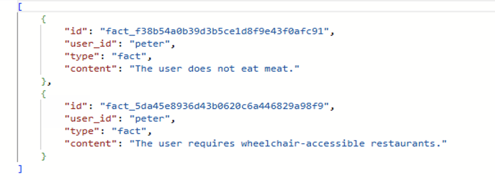
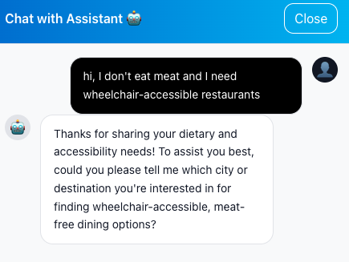
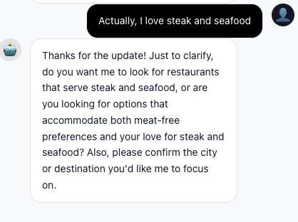
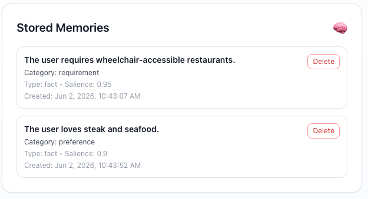
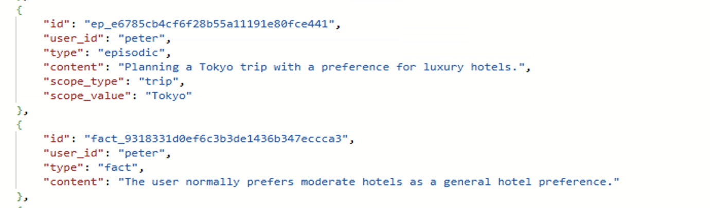
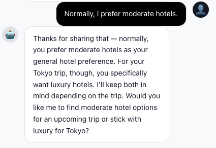
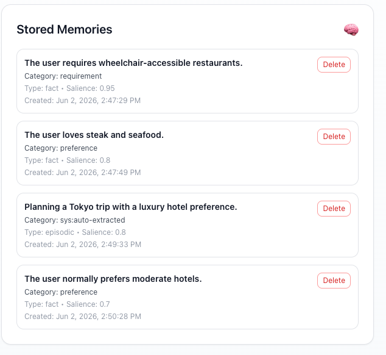

# Module 04 - Making Memory Intelligent

**[< Adding Memory to our Agents](./Module-03.md)** - **[Observability & Tracing >](./Module-05.md)**

## Introduction

In Module 03, you gave your assistant memory. You wired a persistent checkpointer, connected the `azure-cosmos-agent-memory` toolkit. Your agents can now recall user preferences and apply them during searches.

But the memory system you built is still **manual**. It stores the raw turns. It doesn't yet:

- read those turns and *extract* the latent facts ("I'm vegetarian" → fact `Tony does not eat meat`);
- *deduplicate* extracted facts against what's already on file;
- detect *contradictions* (Tony was vegan in March; today he says he loves steak — which is current?);
- *summarise* a long conversation so the system prompt doesn't grow without bound;
- *summarise the user themselves* so a freshly-joined agent can be briefed in one paragraph.

All of that is the **auto-trigger pipeline** inside the toolkit. In this module you'll turn it on, learn what each stage does, tune the cadence so you can see the pipeline run in a short demo, and inspect what shows up in Cosmos after a few minutes of chatting.

Importantly: you **won't write any extraction prompts**. They ship inside the toolkit. Your job in this module is to *operate* an intelligent memory pipeline - choose the cadence that matches your workload, verify it's producing what you expect, and know which lever to pull when it isn't.

## Learning Objectives and Activities

- Understand the five-stage pipeline the toolkit runs on each `push_to_cosmos` call
- Recognise the role of the `counter` container in driving cadence
- Tune the four cadence knobs (`FACT_EXTRACTION_EVERY_N`, `DEDUP_EVERY_N`, `THREAD_SUMMARY_EVERY_N`, `USER_SUMMARY_EVERY_N`) for a workshop-friendly demo
- Watch the pipeline run live and inspect the results in Cosmos Data Explorer

## Module Exercises

1. [Activity 1: From Manual Memory to Intelligent Memory](#activity-1-from-manual-memory-to-intelligent-memory)
2. [Activity 2: The Auto-Trigger Pipeline](#activity-2-the-auto-trigger-pipeline)
3. [Activity 3: Tuning the Cadence](#activity-3-tuning-the-cadence)
4. [Activity 4: Test Your Work](#activity-4-test-your-work)

---

## Activity 1: From Manual Memory to Intelligent Memory

### What "Intelligent Memory" Means

The memory system from Module 03 has four limitations worth naming explicitly:

| Limitation                       | Symptom                                                                                                      |
|----------------------------------|--------------------------------------------------------------------------------------------------------------|
| **Implicit preferences ignored** | "I don't eat meat" never becomes a fact unless the user explicitly says "remember…".                         |
| **Contradictions silently stored** | User says he's vegan on Monday, says he loves steak Friday - both end up in `memories`, agents get whiplash. |
| **No conversational summarisation** | Threads grow until the system prompt is bloated with raw turns.                                              |
| **No user-level summary**        | A new agent joining mid-conversation has to read everything from scratch.                                    |

The auto-trigger pipeline fixes all four - but it does so by running a small chain of LLM-backed steps in the background after each `push_to_cosmos` call. That's not free. So the toolkit lets you control **how often** each stage runs through four environment variables you'll set in Activity 3.

### Why a Pipeline, Not One Big Prompt?

The toolkit could have used one mega-prompt: "given the conversation so far and the existing memories, do everything." It deliberately doesn't, for three reasons:

1. **Each stage has a different cadence.** Fact extraction is cheap and you want it on every turn. User-summary regeneration is expensive and only needs to run occasionally.
2. **Each stage is independently auditable.** Because each stage writes its own log line ("synthesize_procedural", "extract_memories", "thread summary written"), you can tell from the logs what the toolkit decided to do.
3. **You can swap stages independently.** Don't want user-level summaries? Set the cadence to a number larger than your session length and that stage is effectively disabled. Want fact extraction every two turns instead of every turn? One env var change.

The rest of this module is about *operating* the pipeline, not implementing it.

---

## Activity 2: The Auto-Trigger Pipeline

### What Runs on Each `push_to_cosmos`

Every time something (your API-layer turn write, or an agent's `add_turn` call) reaches the toolkit's `push_to_cosmos()`, the toolkit:

1. Writes the buffered raw turn(s) to the `memories_turns` container.
2. Increments a per-`(user_id, thread_id)` counter in the `counter` container.
3. Consults the four cadence env vars and decides which of the five stages below to fire.
4. Runs the eligible stages, writing their outputs to the appropriate container.

The five stages, in order:

| Stage                          | What it does                                                                                                          | Cadence env var              | Output container       |
|--------------------------------|-----------------------------------------------------------------------------------------------------------------------|------------------------------|------------------------|
| **`extract_memories`**         | Reads the unflushed turns for this `(user, thread)` and asks the LLM to extract semantic facts, episodic memories, or procedural memories. | `FACT_EXTRACTION_EVERY_N`    | `memories` (`type=fact / episodic / procedural`) |
| **`dedup_memories`**           | For each new fact, finds nearest-neighbour facts already in `memories` and asks the LLM whether they collide; supersedes the older one when they do. | `DEDUP_EVERY_N`              | `memories` (`superseded=true` on the old record) |
| **`synthesize_procedural`**    | Detects *behavioural* preferences ("answer me in bullet points", "always confirm before booking") that aren't pure facts. | (folded into `FACT_EXTRACTION_EVERY_N`) | `memories` (`type=procedural`) |
| **`synthesize_thread_summary`**| Rolls up the conversation so far into a one-paragraph summary of *this thread*; supersedes the previous thread summary. | `THREAD_SUMMARY_EVERY_N`     | `memories_summaries` (`type=thread_summary`) |
| **`synthesize_user_summary`**  | Rolls up the user's all-time facts + recent thread summaries into a single user-level paragraph; supersedes the previous one. | `USER_SUMMARY_EVERY_N`       | `memories_summaries` (`type=user_summary`) |

> The procedural stage is folded into the fact-extraction cadence - when fact extraction fires, the toolkit also gives the LLM the opportunity to surface a procedural memory. There isn't a separate `PROCEDURAL_EVERY_N` knob.

### The `counter` Container

The cadence knobs are integers (`5` = "every 5 turns"), so the toolkit needs to know **how many unflushed turns** each `(user, thread)` has accumulated since the last time each stage fired. That counter lives in the `counter` container - one document per active conversation, with a small JSON blob:

```json
{
  "id": "tony__session_abc123",
  "user_id": "tony",
  "thread_id": "session_abc123",
  "_unflushed_turn_counts": {
    "extract": 3,
    "thread_summary": 3,
    "user_summary": 12,
    "dedup": 3
  }
}
```

After each turn:

- All four counters are incremented.
- For each cadence knob `<= counter`, the corresponding stage fires.
- Stages that fire reset their counter back to 0.

### Why You Don't Edit the Extraction Prompts

The extraction, dedup, and summary prompts live inside the toolkit and are versioned with the package. You can read them here if you're curious (<https://github.com/AzureCosmosDB/AgentMemoryToolkit>), but you don't author or maintain them - the toolkit team does. You configure the *operating behaviour* (cadence, embedding model, chat model) and let the toolkit do the rest.

That's deliberate: the prompts have been validated against a wider corpus than any one workshop. Letting attendees swap them in module-time would tempt them to overfit to one demo and break the rest of the pipeline.

---

## Activity 3: Tuning the Cadence

### The Four Knobs

The toolkit reads four env vars at client-create time:

| Variable                       | What it controls                                                            | SDK default | Workshop value          |
|--------------------------------|-----------------------------------------------------------------------------|-------------|-------------------------|
| `FACT_EXTRACTION_EVERY_N`      | How many turns between fact-extraction runs (also gates procedural).        | `1`         | **`1`** (every turn)    |
| `DEDUP_EVERY_N`                | How many turns between dedup-vs-existing-facts runs.                        | `5`         | **`1`** (every turn)    |
| `THREAD_SUMMARY_EVERY_N`       | How many turns between thread-summary regenerations.                        | `10`        | **`5`** (every 5 turns) |
| `USER_SUMMARY_EVERY_N`         | How many turns between user-level summary regenerations.                    | `20`        | **`5`** (every 5 turns) |

The defaults are tuned for **production** workloads - you don't want to call out to an LLM 4× per turn for every user. The workshop values are tuned for **a 20-minute demo** - you want to see the summarizer actually fire while you're watching.

You're free to experiment. Raise `THREAD_SUMMARY_EVERY_N` to `20` and you'll have to chat for a while before you see a summary land; drop `FACT_EXTRACTION_EVERY_N` to `1` and every preference statement gets extracted immediately.

### Step 1: Verify the Workshop Values

These are already in `python/.env` and `mcp_server/.env` (the Bicep + azd hooks copy them in for a fresh deployment). But if you're working in a partially-set-up `.env`, make sure both files include:

```bash
FACT_EXTRACTION_EVERY_N=1
DEDUP_EVERY_N=1
THREAD_SUMMARY_EVERY_N=5
USER_SUMMARY_EVERY_N=5
```

## Activity 4: Test Your Work

With all intelligent memory features connected, it's time to test the system end-to-end! This activity will verify automatic preference extraction, conflict detection, and auto-summarization.

### Restart All Services

Since we've added new tools and agent logic, we need to restart all services to load the changes.

**Terminal 1 (MCP Server):**

Stop the currently running MCP server (press **Ctrl+C**), then restart it:

```powershell
cd mcp_server
$env:PYTHONPATH="..\python"; python mcp_http_server.py
```

**Important**: Always ensure your virtual environment is activated before starting the server!

You must be in **multi-agent-workshop\01_exercises** folder and then use the below commands to activate the virtual environment. And after activating the environment, follow the above commands to re-start the mcp server.  

```powershell
cd multi-agent-workshop\01_exercises
.\venv\Scripts\Activate.ps1
```

**Terminal 2 (Backend API):**

Stop the currently running backend (press **Ctrl+C**), then restart it:

```powershell
cd python
uvicorn src.app.travel_agents_api:app --reload --host 0.0.0.0 --port 8000
```

**Important**: Always ensure your virtual environment is activated before starting the server!

You must be in **multi-agent-workshop\01_exercises** folder and then use the below commands to activate the virtual environment. And after activating the environment, follow the above commands to re-start the backend server.  

```powershell
cd multi-agent-workshop\01_exercises
.\venv\Scripts\Activate.ps1
```

**Terminal 3 (Frontend):**

Stop the currently running frontend (press **Ctrl+C**), then restart it:

> **Note**: The frontend doesn't require virtual environment activation since it uses Node.js.

**All Platforms:**

```bash
cd multi-agent-workshop/01_exercises/frontend
npm start
```

#### Test 1: Automatic Preference Extraction (Implicit Statements)

1. Sign in as **Peter** (no seed memories).
2. Send: `Hi, I don't eat meat and I need wheelchair-accessible restaurants`
3. Open Azure Data Explorer (Cosmos DB).
4. Query the `memories` container (it might take ~ 1-2 seconds for the fact to appear):

   ```sql
   SELECT c.id, c.user_id, c.type, c.content FROM c where c.user_id = "peter"
   ```

Expected: two new fact records, salience ≥ 0.8. The agent didn't have to be asked to remember - the pipeline did it.

**Cosmos DB output would look like this**:

> 

**Chat Assistant output would look like this**:
> 

You can close the chat, and go to the profile & memories tab, and you will see these stored memories there(sometimes tale ~ 2-3 seconds to show)
> 

#### Test 2: Conflict Detection 

1. Same Peter session, send: `Actually, I love steak and seafood`
2. Wait, re-query `memories`.
3. Open Azure Data Explorer (Cosmos DB).
4. Query the `memories` container (it might take ~ 2-3 seconds for the fact to appear):

   ```sql
   SELECT c.id, c.user_id, c.type, c.content, c.superseded_by, c.supersede_reason, c.superseded_at FROM c where c.user_id = "peter"
   ```
**Cosmos DB output would look like this**:   
>    

**Chat Assistant output would look like this**:
> 

You can close the chat again, and go to the profile & memories tab, and you will see the updated stored memories there(sometimes tale ~ 2-3 seconds to show)
> 


### Test 3: Trip-Specific Context (Episodic Memory)

**Objective:** Verify that trip-specific preferences don't conflict with general preferences.

**Steps:**

- Start a new conversation (log out and back in as Peter/Bruce, the user you choose before)
- Send: `For this Tokyo trip, I want luxury accommodations`
- Open Azure Data Explorer (Cosmos DB).
- Query the `memories` container (it might take ~ 2-3 seconds for the fact to appear):- Check Cosmos DB memories

   ```sql
   SELECT c.id, c.user_id, c.type, c.content, c.scope_type, c.scope_value FROM c where c.user_id = "peter"
   ```
**Cosmos DB output would look like this**:   
>    

**Chat Assistant output would look like this**:
> 

You can close the chat again, and go to the profile & memories tab, and you will see the updated stored memories there(sometimes tale ~ 2-3 seconds to show)
> 


- Continue the same conversation.
- Send: `Normally, I prefer moderate hotels.`
- Open Azure Data Explorer (Cosmos DB).
- Query the `memories` container (it might take ~ 2-3 seconds for the fact to appear):- Check Cosmos DB memories

   ```sql
   SELECT c.id, c.user_id, c.type, c.content, c.superseded_by, c.supersede_reason, c.superseded_at FROM c where c.user_id = "peter"
   ```
**Cosmos DB output would look like this**:   
>    

**Chat Assistant output would look like this**:
> 

You can close the chat again, and go to the profile & memories tab, and you will see the updated stored memories there(sometimes tale ~ 2-3 seconds to show)
> 

We can see that the facts are stored seperatly with different scope, and they don't conflict with each other. The general preference is still intact, and the trip-specific preference is stored as episodic memory.


### Test 4: Skipping Non-Preference Messages

**Objective:** Verify that greetings and simple responses don't trigger memory extraction.

**Steps:**

- Start a new conversation (log out and back in as Peter/Bruce, the user you choose before)
- Send: `Hello!`
- Send: `Yes`
- Send: `Thanks`
- Check backend or mcp server logs for extraction calls

### Test 5: Auto-Summarization After Crossing the Threshold

- Start a new conversation (log out and back in as Peter/Bruce, the user you choose before), 
- Send 5 more messages of trip planning so the counter passes `THREAD_SUMMARY_EVERY_N=5`.
- Some example messages you can send:
   - `Hi, I'm planning a trip to Paris`
   - `Find hotels in Paris`
   - `I want luxury hotels`
   - `Find restaurants`
   - `Show me vegetarian options`
   - `What about activities?`
   - `Find historic places`
   - `Create an itinerary for 3 days now.`
   - `That looks great! What else can you recommend?`
- Query `memories_summaries`:

   ```sql
   SELECT c.type, c.content, c.version FROM c WHERE c.user_id = "peter" ORDER BY c.created_at DESC
   ```

Expected: a `thread_summary` record (and within a few more turns, a `user_summary` record).

### Verification Checklist

| Check                                                                | Status |
|----------------------------------------------------------------------|--------|
| Cadence env vars set in `python/.env` and `mcp_server/.env`          | ⬜      |
| Backend logs show `extract_memories`, `dedup_memories`, etc. firing  | ⬜      |
| `counter` container has one row per `(user, thread)`                 | ⬜      |

### Common Issues

**Pipeline never fires.**
Did you restart the backend AND MCP server after changing the env vars? Did you check `client._extract_memory_every_n` reflects your override?

**Facts get extracted but never deduplicated.**
`DEDUP_EVERY_N` is too high, or your fresh-user contradiction is across `(user, thread)` boundaries (dedup is per-user, but you may need a few turns in the same thread for both facts to enter the dedup window). Drop `DEDUP_EVERY_N=1` and try again.

**Summaries never appear.**
You haven't chatted past the cadence threshold. Bump `THREAD_SUMMARY_EVERY_N` down to `3` temporarily and try again. Remember to restart the backend after the env change.

**The agent still recites Tony's old preferences after dedup superseded them.**
The agent's `recall_memories` call should be returning the *non-superseded* records — that filter happens inside `search_cosmos`. If you see superseded records leaking through, you're probably calling `get_memories` directly somewhere; switch to `search_cosmos`.

---

In Module 05 you'll layer observability and tracing on top of all this so you can see — in production — *which* stages fired *when* and *what* they cost. The cadence knobs you just chose become a real performance dial once you have the metrics to see them.

Proceed to Module 05: **[Observability & Tracing](./Module-05.md)**
