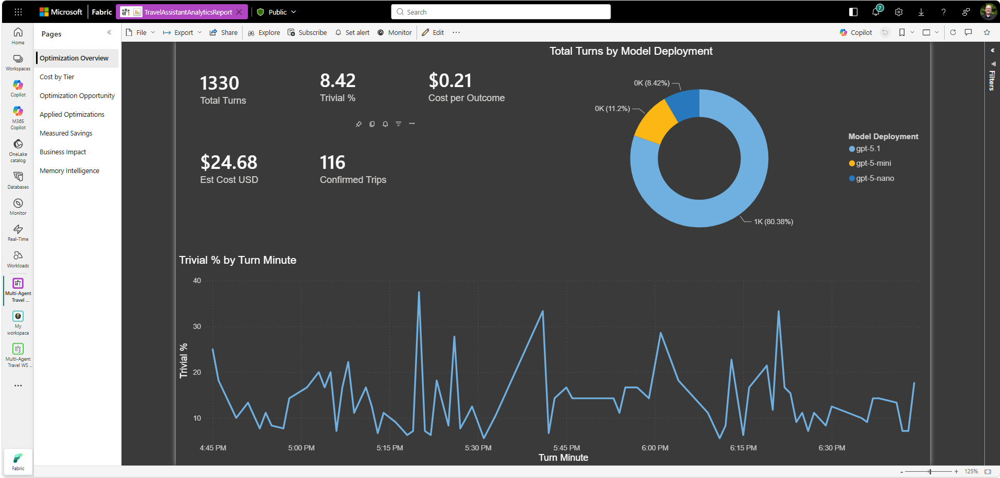
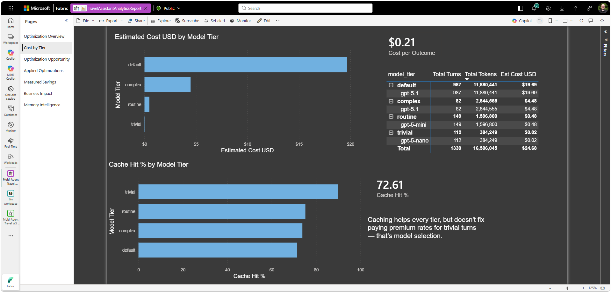
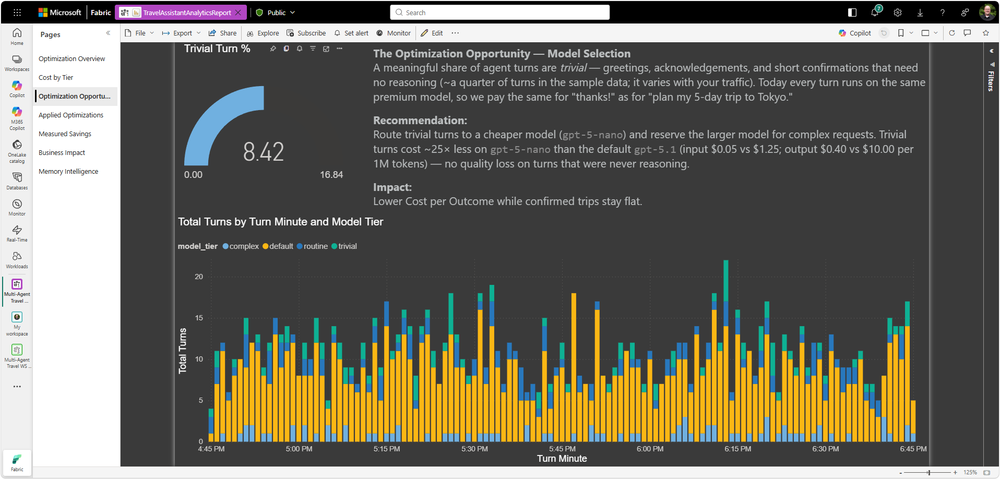
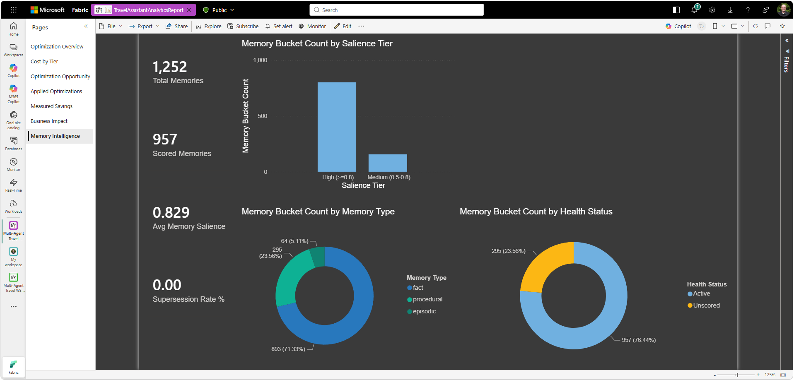
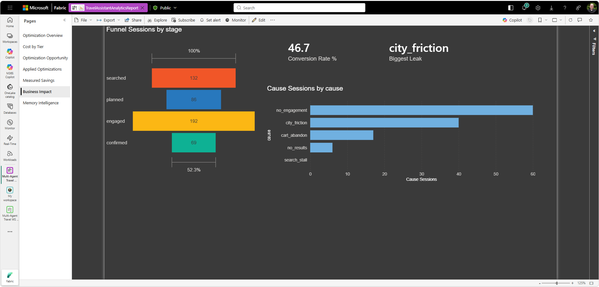
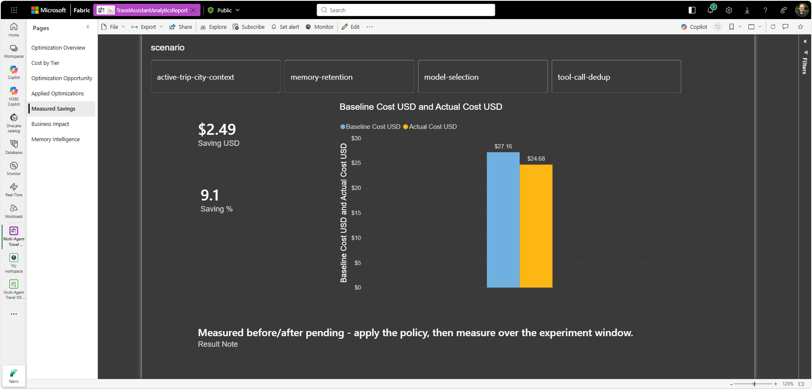
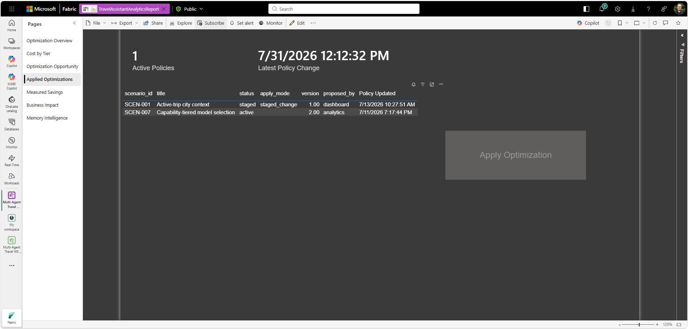

# Power BI Report Build Guide

> **You usually don't need this guide.** The finished report (`analytics/TravelAssistantAnalyticsReport.pbix`) is **auto-deployed to your Fabric workspace** by `Provision-Fabric.ps1` (Phase 3), already pointed at your mirror — attendees never open Power BI Desktop. This guide is for **maintainers** who want to **rebuild or customize** that report.

Build the full **Travel Assistant Analytics** report in Power BI Desktop against your **Fabric mirrored database**. The report is organized as the **optimization loop**, not a pile of charts: a **Portfolio Overview** and a **Discovered Optimizations** card gallery lead (*what happened → what to do next*), a **Model Selection Projected Impact** page sizes the payoff, four **dimension deep‑dives** (Model Selection, Memory Intelligence, Agent Collaboration, Business Impact) carry the detail, and a **Governance & Measured Saving** page closes the loop (*apply → re‑measure*). It produces the committed **`.pbix`** the provisioning imports (the script overrides its `MirrorSQLEndpoint` / `MirrorDatabase` parameters per deployment).

Use **DirectQuery over the mirrored database SQL endpoint**. Build the report from DAX measures over the raw mirrored tables — a re-pointable, parameterized `.pbix`, with no separate semantic model to create.

---

## Report design rationale (read this first)

**What this report is.** The product vision fixes a hard split: **Azure Cosmos DB is the operational system of record; Fabric is the analytical *and optimization* system of record** — the layer that turns telemetry into *what should we do next* and *how does the system keep improving* (`docs/vision/agent-analytics-and-optimization-vision.md`). This report is the **Fabric-side surface of the optimization loop** (Agents → Cosmos → Fabric analytics → optimization intelligence → Agents), not a dashboard bolted onto the app. Its job is to move a viewer up the **optimization maturity ladder**: **L1 Visibility → L2 Recommendations → L3 Assisted → (measured) L4**.

**Console vs report — one loop, two surfaces (ADR-0001).** The **Optimization Console** is the operator's *live apply cockpit* — real-time, one dataset, action-first, always-works. This **report is the enterprise BI surface of the same loop** — historical, fleet-scale, explainable, drill-through. ADR-0001's 2026-08-01 updates promote Power BI from "L1 visibility only" to a **co-equal, action-capable card surface** (an HTML recommendation-card gallery + selection-bound Apply/Revert translytical buttons, see Page 8), gated today only by a transient product bug — not a permanent limitation.

**Organizing principle — agents × dimensions (ADR-0010).** ADR-0010 supersedes the old model-selection-centric layout: the first question an owner asks is *"how is each agent doing?"*, and issues should be **discovered** by an analyst, not restated from a fixed list. So the report **leads with a portfolio rollup and a discovered-optimizations feed**, then drills into **dimension deep-dives**. The target *primary* surface — **per-agent scorecards with derived health** — is now buildable: node-grain telemetry has landed (`NodeExecutions`), so **Page 6b (Agent Performance)** renders the real per-agent × dimension scorecard (3 of 8 dimensions scored today). The remaining step is the **LLM analyst** that *discovers* opportunities (Module 09); the other deep-dives (model-fit, memory, agent-path, business impact) remain the dimension detail around it.

**Console-parity vs analytics-only value.** The report **mirrors the console** where it should — the recommendation/opportunity **card gallery**, same theme and badges (Pages 2, 4, 6) — and **adds what a live console can't**: single-pane fleet rollups, historical trend, agent-vs-fleet cost concentration, **what-if projection onto future volume** (Page 3), and memory-lifecycle analytics (Page 5). That delta is the differentiation the vision claims for the Fabric analytical plane.

**Buildable today vs. pending instrumentation.** Every page in this guide binds to data that **exists now** (`OptimizationInsights` + `OptimizationTurns` + `Trips` + `OptimizationPolicies`). The **agent scorecard** (per-agent health) is now buildable — node-grain telemetry (`NodeExecutions`) has landed, so **Page 6b** renders it (3 of 8 dimensions scored; the other 5 name the signal they need). **Analyst-generated** discovered opportunities remain the next step (the analyst-in-reverse-ETL, Module 09). Where a page is a stand-in for that target, it says so.

## Report architecture (page map)

| # | Page | Loop role | Vision pillar | Maturity | Surface |
|---|------|-----------|---------------|----------|---------|
| 1 | **Portfolio Overview** | *What happened* (fleet) | All (rollup) | L1 | analytics-only rollup |
| 2 | **Discovered Optimizations** | *What to do next* | cross-cutting | L2 | **console-parity** gallery |
| 3 | **Model Selection Projected Impact** | *How big is the payoff* | Cost / Business | L2→L3 | analytics-only |
| 4 | Model Selection Diagnosis | Cost detail + fix | Cost Intelligence | L1→L2 | dimension detail |
| 5 | Memory Intelligence *(deep-dive)* | Memory lifecycle | Memory Intelligence | L1→L2 | dimension detail |
| 6 | Agent Collaboration — Agent-Path Cost *(deep-dive)* | Routing / handoff cost | Agent Collaboration | L1 | agent-scorecard stand-in |
| 6b | **Agent Performance — per-agent scorecard** *(node-grain)* | *How is each agent doing* | Agent Collaboration | L1→L2 | **console-parity** scorecard |
| 7 | Business Impact — Conversion *(deep-dive)* | Outcomes / funnel | Cost + Workflow | L1→L2 | dimension detail |
| 8 | **Governance & Measured Saving** | *Apply → re-measure* | cross-cutting | L3→L4 | **console-parity** apply + audit |

> **Build order tip:** create the Step-3 measures once, then build **Page 8** and **Page 4** first — they define most of the measures the leading pages reuse (`Saving USD`, `Baseline/Actual Cost USD`, `Cost per Outcome`, `Conversion Rate %`). Then build Pages 1–3. Finally, **arrange the report tabs in the 1–8 order above** for the reading flow.

---

## Prerequisites

- **Power BI Desktop** installed (latest version).
- A **Fabric mirrored database** of your Cosmos analytics is running and replicating (see `analytics/fabric/README.md`). It mirrors at least `OptimizationTurns`, `Trips`, `Configuration`, and `OptimizationInsights`.
- Your mirror's **SQL analytics endpoint** and **database name**.

To find the SQL analytics endpoint:
1. Open your **Mirrored database** in the Fabric portal.
2. Click the **SQL analytics endpoint** dropdown (top-left, next to the mirror name).
3. Copy the connection string (e.g., `xxxxx.datawarehouse.fabric.microsoft.com`).
4. Note the **database name** — it is the mirror artifact name (e.g., `TravelAssistantAnalytics`), and the **schema** is your Cosmos database name (e.g., `TravelAssistant`).

---

## Step 0: Apply the Console Theme (recommended — do this first)

The report ships with a Power BI theme that matches the **Optimization Console** exactly — same dark navy canvas, panel cards, borders, text, and the accent-blue → mint → gold → green → red palette (badges, KPI sentiment). Applying it **first** means every visual you add adopts the look automatically.

**File:** `analytics/PowerBI_Console_Theme.json`

- **Power BI Desktop:** **View** ribbon → **Themes** (gallery dropdown) → **Browse for themes** → select `analytics\PowerBI_Console_Theme.json`.
- **Power BI Service (browser Edit):** open the report → **Edit** → **View** → **Theme** → **Browse for themes** → same file. (Use this path if Desktop is unavailable.)

After importing:
- Existing and new visuals adopt the palette, borders (12px rounded), and typography automatically.
- If a page still shows a white canvas, set its **background** to *None*/transparent (or `#0F1420`) under **Format your report page → Canvas background** so the dark canvas reads through.
- The theme mirrors the analytics portal's `:root` tokens (`analytics/dashboard/index.html`) — if that palette ever changes, regenerate this JSON from the same tokens to keep the two surfaces in sync.

---

## Step 1: Connect to the Mirror (DirectQuery)

1. Open **Power BI Desktop**.
2. **Get Data** → **SQL Server database**.
3. **Server:** your mirror SQL analytics endpoint URL.
4. **Database:** the mirror name (e.g., `TravelAssistantAnalytics`).
5. **Data Connectivity mode:** **DirectQuery**.
6. **OK**, then in the credentials dialog select the **Microsoft account** tab on the left (a.k.a. organizational account) → **Sign in** → **Connect**.
   > Do not use the Windows tab. If you see **`Microsoft SQL: Integrated Security not supported.`**, clear permissions via **File → Options and settings → Data source settings → Clear Permissions**, then reconnect with **Microsoft account**.
   >
   > Alternative: **Get Data → Microsoft Fabric → OneLake data hub**, then pick your **SQL analytics endpoint**.
7. In the Navigator, expand the schema (your Cosmos DB name, e.g., `TravelAssistant`) and select:

| Table | Used for |
|-------|----------|
| `OptimizationTurns` | every KPI, cost-by-tier, model usage, trivial % |
| `Trips` | confirmed outcomes, cost per outcome |
| `OptimizationPolicies` | applied-optimizations audit (Page 8) |
| `OptimizationGovernance` | governance **decision-audit trail** (Page 8) — filter `type = "decision"` |
| `Configuration` | multi-type config store — loads **unfiltered**; today only its `type = "model_pricing"` rows are read (by `Est Cost USD`), the rest stay available |
| `OptimizationInsights` | reverse-ETL output (funnel, causes, KPIs) — powers the **Business Impact** page |

8. Click **Load** (not Transform Data).

## Step 2: Parameterize the connection (REQUIRED — makes the `.pbix` re-pointable)

Step 1 hard-codes your SQL endpoint into every query. That's a problem for the **committed `.pbix`**: `Provision-Fabric.ps1` re-points the report per deployment by **overriding the `MirrorSQLEndpoint` / `MirrorDatabase` parameters** — so if those parameters don't exist, the shipped `.pbix` hard-codes *your* mirror and every deployment silently queries it (this report previously shipped with that exact bug). Convert the source to parameters so provisioning (and anyone who opens it) can re-point it:

1. **Home → Transform data** to open Power Query.
2. **Manage Parameters → New Parameter**, twice:
   - `MirrorSQLEndpoint` — Type **Text**, **Required**, **Current Value** = your SQL endpoint host.
   - `MirrorDatabase` — Type **Text**, **Required**, **Current Value** = your mirror name (e.g. `TravelAssistantAnalytics`).
3. For **every** table, open the **Advanced Editor** and change the source line to use the parameters:

   ```m
   Source = Sql.Database(MirrorSQLEndpoint, MirrorDatabase),
   ```

   (replacing the literal `Sql.Database("<your-endpoint>", "<your-db>")`).
4. **Close & Apply.**

> **We ship the `.pbix` only — you don't need a `.pbit`.** The parameters above are what make the `.pbix` re-pointable: provisioning overrides them per deployment, so whatever values are baked in don't matter. A `.pbit` is only needed if someone wants to open the report in Desktop from scratch — export one **on demand** (**File → Export → Power BI template**); it's never committed.

> **Caution — only relevant if you *do* export a `.pbit`.** Power BI Desktop silently re-bakes the literal server back into the M query when you re-save, **and** caches pending edits (with their literal servers) in an `UnappliedChanges` part. Before **File → Export → Power BI template**: (1) **Home → Close & Apply** so there are **no** unapplied changes, (2) re-open each table's **Advanced Editor** and confirm it reads `Sql.Database(MirrorSQLEndpoint, MirrorDatabase)`, and (3) unzip the `.pbit` and grep **every** part — not just `DataModelSchema`, also `UnappliedChanges` — for `datawarehouse.fabric.microsoft.com`; there must be **zero** matches.

---

## Step 3: Create the Measures (the analytics)

> ### 📋 Complete measure catalog — create ALL of these before placing any visual
> A blank/`--` card is most often a measure you haven't created yet. There are **43 measures** across **two tables**, plus **3 calculated columns**. Create each on its **Home table** (right-click the table in the Fields pane → **New measure**). **All the DAX is in this step**, in dependency order: the **calculated columns first**, then the **`OptimizationTurns`** measures, then the **`OptimizationInsights`** reverse-ETL group. Each page then just *places* the finished measures by name — the tables below are the index.
>
> ⚠️ **Each DAX code block below defines *several* measures** (separated by blank lines). Create them **one at a time** — one **New measure** per `Name =` definition. Pasting a whole block into a single New measure makes Power BI keep only the first name and report the *other* names as **"missing."**
>
> **On `'TravelAssistant OptimizationTurns'`** — DAX in this step, below:
>
> | Measure | Purpose |
> |---|---|
> | `Total Turns` | count of captured turns |
> | `Total Tokens` | Σ `total_tokens` |
> | `Trivial Turns` | turns where `complexity_tier = "trivial"` |
> | `Trivial %` | trivial share of turns |
> | `Est Cost USD` | per-turn cost priced from `Configuration` |
> | `Confirmed Trips` | trips `confirmed`/`completed` |
> | `Cost per Outcome` | Est Cost ÷ Confirmed Trips |
> | `Cached Tokens` | Σ `cached_tokens` |
> | `Cache Hit %` | cached ÷ input tokens |
> | `Active Policies` | policies with `status = "active"` |
> | `Latest Policy Change` | most recent policy `updated_epoch` |
>
> *Calculated columns (New column, not measure): `Turn Time`, `Turn Minute` on `OptimizationTurns`; `Policy Updated` on `OptimizationPolicies` — all in this step.*
>
> **On `'TravelAssistant OptimizationInsights'`** (the reverse-ETL table) — DAX in this step, below; the *Used on* column is where each measure is placed:
>
> | Measure | Used on | Purpose |
> |---|---|---|
> | `Open Opportunities` | Page 1 | count of `recommendation_card` rows |
> | `Est Saving USD` | Page 1 | Σ `estimated_saving_usd` (recommendation_card) |
> | `Recommendation Cards HTML` | Page 2 | HTML gallery of the recommendation cards |
> | `MS Saving USD` | Page 3 | **`MS` = Model Selection** — model-selection measured saving |
> | `MS Turns` | Page 3 | model-selection turn count |
> | `Per-Turn Saving USD` | Page 3 | MS Saving ÷ MS Turns |
> | `Projected Monthly Saving USD` | Page 3 | per-turn saving × Turns/Day × 30 |
> | `Memory Bucket Count` | Page 5 | Σ `count` (memory buckets) |
> | `Total Memories` | Page 5 | `memory_type` total |
> | `Scored Memories` | Page 5 | scored memories (excl. `Unscored`) |
> | `Avg Memory Salience` | Page 5 | avg salience (`memory_kpi`) |
> | `Supersession Rate %` | Page 5 | superseded ÷ total |
> | `Path Tokens` | Page 6 | tokens per `agent_path` |
> | `Path Turns` | Page 6 | turns per `agent_path` |
> | `All Path Tokens` | Page 6 | tokens across all paths |
> | `Path Token Share %` | Page 6 | path share of all tokens |
> | `Top Path Share %` | Page 6 | most-expensive path's share (headline) |
> | `Agent Path Cards HTML` | Page 6 | HTML agent-path cost cards |
> | `Funnel Sessions` | Page 7 | sessions per `funnel_stage` |
> | `Cause Sessions` | Page 7 | sessions per `abandonment_cause` |
> | `Conversion Rate %` | Page 7 | conversion rate (`conversion_kpi`) |
> | `Biggest Leak` | Page 7 | biggest leak cause (text) |
> | `Saving USD` | Page 8 | measured saving (`optimization_result`) |
> | `Saving %` | Page 8 | measured saving % |
> | `Baseline Cost USD` | Page 8 | baseline cost |
> | `Actual Cost USD` | Page 8 | actual cost |
> | `Result Note` | Page 8 | per-method note: governed / telemetry / measured (text) |
> | `Selected Apply Mode` | Page 8 | `apply_mode` of the scenario-slicer selection (button gating) |
> | `Apply Scenario` | Page 8 | selected scenario if applyable (`policy`/`auto`), else `BLANK()` — the button's `scenario` param |
> | `Apply Button Fill` | Page 8 | green when applyable, grey when not (conditional fill) |
> | `Apply Button Text` | Page 8 | button label ("Apply Optimization" / "Apply — not available…") |
> | `Apply Button Tooltip` | Page 8 | why the button is/isn't fireable |
>
> **New flat card columns (not measures):** `evidence_line` and `caveat` on the `recommendation_card` rows feed the Page 2 gallery (per-scenario proof + yellow ⚠ caveat). Both producers emit them; refresh the model schema if they're missing from the field list.
>
> **Auto-created** (do NOT hand-author): the **`Turns per Day`** What-If parameter — created **in this step**, just before the Model-selection What-If measures (*Modeling → New parameter → Numeric range*) — generates the `'Turns per Day'` table + `[Turns per Day Value]` measure + a slicer.

### Calculated columns (create these first)

Create these with **New column** (right-click the table → **New column**) — *not* New measure. Set each one's **Data type / Format = Date/time**. **No measure depends on them** — they feed **visual axes** (the time charts) and the Page 8 policy table — but they're foundational, so create them before the measures.

```DAX
-- Table: 'TravelAssistant OptimizationTurns'
Turn Time =
VAR e    = 'TravelAssistant OptimizationTurns'[turn_epoch]
VAR days = INT ( e / 86400 )
VAR sod  = e - days * 86400
RETURN ( DATE(1970,1,1) + days ) + TIME ( INT ( sod / 3600 ), INT ( MOD ( sod, 3600 ) / 60 ), MOD ( sod, 60 ) )

Turn Minute =
VAR e    = 'TravelAssistant OptimizationTurns'[turn_epoch]
VAR days = INT ( e / 86400 )
VAR sod  = e - days * 86400
RETURN ( DATE(1970,1,1) + days ) + TIME ( INT ( sod / 3600 ), INT ( MOD ( sod, 3600 ) / 60 ), 0 )

-- Table: 'TravelAssistant OptimizationPolicies'
Policy Updated =
VAR e    = 'TravelAssistant OptimizationPolicies'[updated_epoch]
VAR days = INT ( e / 86400 )
VAR sod  = e - days * 86400
RETURN ( DATE(1970,1,1) + days ) + TIME ( INT ( sod / 3600 ), INT ( MOD ( sod, 3600 ) / 60 ), MOD ( sod, 60 ) )
```

> **Why the split-out `days`/`TIME()` form (not `DATE(1970,1,1) + epoch/86400`)?** Over **DirectQuery**, adding a ~46,000 date-serial to a tiny minute/second fraction loses sub-day precision when the expression folds to the mirror's SQL — every row within the same day collapses to one value, so a minute-level time axis shows a single point. Building the date from an **integer** day serial and adding the time-of-day via **`TIME()`** keeps the minutes distinct.

Use `Turn Minute` on time axes (set **X-axis Type = Continuous**, plain field) and `Turn Time` for detail.

### OptimizationTurns measures

Add these measures to the **`TravelAssistant OptimizationTurns`** table (right-click → **New measure**). Use the schema-prefixed table names shown below.

**Pricing comes from the mirrored `Configuration` table** — no CSV to load. `Configuration` is one of the mirrored tables (alongside `OptimizationTurns`, `Trips`, `OptimizationPolicies`), so it's already in the model as **`TravelAssistant Configuration`**. Its `type = "model_pricing"` rows carry `model`, `input_price`, and `output_price` — the same numbers the app and the notebook use. `Est Cost USD` looks prices up from it, so changing a price is done once (at deploy time, from `python/data/model_pricing.json`) and flows everywhere. Models are discovered from the data; any model without a pricing row falls back to the default in the measure.

```DAX
Total Turns   = COUNTROWS('TravelAssistant OptimizationTurns')
Total Tokens  = SUM('TravelAssistant OptimizationTurns'[total_tokens])

Trivial Turns = CALCULATE(COUNTROWS('TravelAssistant OptimizationTurns'), 'TravelAssistant OptimizationTurns'[complexity_tier] = "trivial")
Trivial %     = DIVIDE([Trivial Turns], [Total Turns], 0) * 100

Est Cost USD =
SUMX(
    'TravelAssistant OptimizationTurns',
    VAR d    = 'TravelAssistant OptimizationTurns'[model_deployment]
    -- Prices are DATA-DRIVEN: looked up per model from the mirrored Configuration table
    -- (type = "model_pricing", seeded from python/data/model_pricing.json). The 1.25 / 10.0
    -- literals are ONLY a fallback for a model_deployment with no pricing row yet — they are
    -- the gpt-5.1 premium rate, so an unpriced model is costed conservatively instead of $0.
    -- seed_configuration.py writes a row per deployed model, so this rarely fires; if the
    -- premium price ever changes in model_pricing.json, update these two literals to match.
    VAR pin  = COALESCE(LOOKUPVALUE('TravelAssistant Configuration'[input_price],  'TravelAssistant Configuration'[type], "model_pricing", 'TravelAssistant Configuration'[model], d), 1.25)   -- fallback = gpt-5.1 input price
    VAR pout = COALESCE(LOOKUPVALUE('TravelAssistant Configuration'[output_price], 'TravelAssistant Configuration'[type], "model_pricing", 'TravelAssistant Configuration'[model], d), 10.0)   -- fallback = gpt-5.1 output price
    RETURN ('TravelAssistant OptimizationTurns'[input_tokens] * pin + 'TravelAssistant OptimizationTurns'[output_tokens] * pout) / 1000000
)

Confirmed Trips  =
    CALCULATE(
        COUNTROWS('TravelAssistant Trips'),
        'TravelAssistant Trips'[status] IN {"confirmed", "completed"},
        TREATAS(VALUES('TravelAssistant OptimizationTurns'[tenantId]), 'TravelAssistant Trips'[tenantId])
    )
Cost per Outcome = DIVIDE([Est Cost USD], [Confirmed Trips])

Cached Tokens = SUM('TravelAssistant OptimizationTurns'[cached_tokens])
Cache Hit %   = DIVIDE([Cached Tokens], SUM('TravelAssistant OptimizationTurns'[input_tokens])) * 100

Active Policies      = CALCULATE(COUNTROWS('TravelAssistant OptimizationPolicies'), 'TravelAssistant OptimizationPolicies'[status] = "active")
Latest Policy Change = DATE(1970,1,1) + MAX('TravelAssistant OptimizationPolicies'[updated_epoch]) / 86400.0
```

> **Token pricing** is a list-price estimate stored in the mirrored `Configuration` table; to change it, edit `python/data/model_pricing.json` and re-run the deploy — no DAX edits.
> Set **`Latest Policy Change`** Format = **Date time**.

> ⚠️ **`Confirmed Trips` must be tenant-scoped explicitly (there is no relationship to `Trips`).** The pages filter/slice on `OptimizationTurns[tenantId]`, but `Confirmed Trips` counts the **`Trips`** table — a *different* table with no relationship to `OptimizationTurns`. Without the `TREATAS(...)` line above, the tenant filter **does not reach `Trips`**, so the card shows the **global** confirmed-trip count across *all* tenants (e.g. ~116 with the seed data) instead of the selected tenant's (~9 for `analytics`) — and `Cost per Outcome` is wrong by the same factor. The `TREATAS` transfers the current `OptimizationTurns[tenantId]` selection onto `Trips[tenantId]` so the measure honors the page filter / tenant slicer. (Do **not** build a physical `tenantId` relationship — it's high-cardinality and would fan out; `TREATAS` is the correct virtual-relationship fix.)

> **Re-bind tier measures after a schema change (the `--` gotcha).** A measure authored while its column didn't yet exist (e.g. before the mirror surfaced `complexity_tier` — see the [Field rename](#field-rename-model_tier---complexity_tier-tiers---complexity_tiers) section) saves in an error state and **won't self-heal**: a tier card shows `--` even though `complexity_tier` has data. Fix: open `[Trivial Turns]`, press **Enter** to re-validate it against the now-present column (or delete and re-create it), and confirm no measure / calculated column / visual axis / matrix row / slicer / filter still references `model_tier`. The `, 0` third argument on `[Trivial %]`'s `DIVIDE` makes an empty tier read **0.0** instead of a blank `--`.

### OptimizationInsights measures (the reverse-ETL group)

All of these live on the **`'TravelAssistant OptimizationInsights'`** table (right-click → **New measure**). They read the flat rows the reverse-ETL writes, so most carry a `type` filter. They're grouped by the page that *uses* them — create them all here; each page then just places them.

**Portfolio & opportunities (used on Page 1):**

```DAX
Open Opportunities =
    CALCULATE(COUNTROWS('TravelAssistant OptimizationInsights'),
              'TravelAssistant OptimizationInsights'[type] = "recommendation_card")

Est Saving USD =
    CALCULATE(SUM('TravelAssistant OptimizationInsights'[estimated_saving_usd]),
              'TravelAssistant OptimizationInsights'[type] = "recommendation_card")
```

**Recommendation-card gallery (Page 2)** — badge = `governed_state`, evidence line, ⚠ caveat, selection highlight, responsive wrap-grid:

```DAX
Recommendation Cards HTML =
-- A single slicer on 'TravelAssistant OptimizationInsights'[scenario] drives selection:
-- the picked card gets a highlight border (and companion visuals filter to it).
-- No selection = no highlight. Badge shows the governed_state (policy lifecycle),
-- matching the Optimization Console.
VAR _sel = SELECTEDVALUE('TravelAssistant OptimizationInsights'[scenario])
VAR _rows =
    CALCULATETABLE(
        'TravelAssistant OptimizationInsights',
        'TravelAssistant OptimizationInsights'[type] = "recommendation_card",
        ALL('TravelAssistant OptimizationInsights'[scenario])   -- keep ALL cards even when the slicer picks one
    )
VAR _cards =
    CONCATENATEX(
        _rows,
        VAR _scen  = 'TravelAssistant OptimizationInsights'[scenario]
        VAR _title = 'TravelAssistant OptimizationInsights'[title]
        VAR _dim   = 'TravelAssistant OptimizationInsights'[dimension]
        VAR _mode  = 'TravelAssistant OptimizationInsights'[apply_mode]
        VAR _ev    = 'TravelAssistant OptimizationInsights'[evidence_line]
        VAR _cav   = 'TravelAssistant OptimizationInsights'[caveat]
        VAR _save  = 'TravelAssistant OptimizationInsights'[estimated_saving_usd]
        VAR _saveTxt = IF(_save > 0, "$" & FORMAT(_save, "#,0.00") & " est. saving", "diagnostic — no direct saving")
        -- governed_state: the mirrored policy lifecycle (proposed -> active -> reverted/staged).
        -- No policy doc? diagnostic card -> "insight"; an un-applied policy card -> "proposed".
        VAR _polState =
            CALCULATE(
                MAX('TravelAssistant OptimizationPolicies'[status]),
                FILTER(ALL('TravelAssistant OptimizationPolicies'),
                       'TravelAssistant OptimizationPolicies'[scenario] = _scen)
            )
        VAR _state = COALESCE(_polState, IF(_mode = "diagnostic", "insight", "proposed"))
        VAR _badge = SWITCH(_state,
            "active", "#57d9a3",
            "proposed", "#f6c453",
            "staged", "#f6c453",
            "reverted", "#ff6b6b",
            "insight", "#93a1bd",
            "#4f8cff")
        VAR _border = IF(_scen = _sel,
            "2px solid #6ee7b7;box-shadow:0 0 0 3px rgba(110,231,183,.35)",
            "1px solid #2a3650")
        VAR _evHtml  = IF(LEN(_ev)  > 0, "<div style=""font-size:12.5px;color:#c7d2e6;margin:0 0 8px;"">" & _ev & "</div>", "")
        VAR _cavHtml = IF(LEN(_cav) > 0, "<div style=""font-size:11.5px;color:#f6c453;margin-top:6px;line-height:1.4;"">⚠ " & _cav & "</div>", "")
        RETURN
            "<div style=""background:#1e2740;border:" & _border & ";border-radius:12px;padding:16px 18px;margin:0;font-family:Segoe UI,Roboto,Arial,sans-serif;"">" &
              "<span style=""display:inline-block;padding:3px 9px;border-radius:999px;font-size:11px;font-weight:700;text-transform:uppercase;letter-spacing:.5px;color:" & _badge & ";border:1px solid " & _badge & ";"">" & _state & "</span>" &
              "<div style=""font-size:16px;font-weight:700;color:#e6ecf7;margin:8px 0 2px;"">" & _title & "</div>" &
              "<div style=""font-size:12px;color:#93a1bd;margin-bottom:8px;"">" & _dim & "</div>" &
              _evHtml &
              "<div style=""font-size:20px;font-weight:700;color:#6ee7b7;"">" & _saveTxt & "</div>" &
              _cavHtml &
            "</div>",
        "",
        'TravelAssistant OptimizationInsights'[order], ASC
    )
RETURN "<div style=""display:grid;grid-template-columns:repeat(auto-fill,minmax(320px,1fr));gap:12px;background:#0f1420;padding:8px;"">" & _cards & "</div>"
```

**Model-selection What-If (Page 3).** `[Projected Monthly Saving USD]` depends on the **What-If parameter**, so create that parameter **first** — it auto-generates the `'Turns per Day'[Turns per Day Value]` measure the DAX references:

- **Modeling → New parameter → Numeric range** → Name **`Turns per Day`**, Min `100`, Max `100000`, Increment `100`, Default `1330` (the captured turn count for *this* sample — see note). Power BI generates the `'Turns per Day'` table, the `[Turns per Day Value]` measure, and a slicer (drop the slicer on Page 3).

> ⚠️ **These values describe *this* dataset — they are not universal.** `Default 1330` is the turn count captured in the current sample; it equals `[MS Turns]` (and the `OptimizationTurns` row count). If you run this against your **own** data that number will differ — set the default to *your* captured turn count. Note it is the **total** captured turns reused as a **per-day** anchor (a demo simplification — "assume this volume recurs daily" — not a measured daily rate). `Min 100` / `Max 100000` / `Increment 100` are only slider ergonomics (a sensible floor, enterprise-scale headroom, ~1,000 smooth stops) — adjust them to whatever range fits your volume.

Then add the measures — the **`MS` prefix means *Model Selection*** (these four read the `model-selection` scenario's `optimization_result` row):

```DAX
MS Saving USD =
    CALCULATE(MAX('TravelAssistant OptimizationInsights'[saving_usd]),
              'TravelAssistant OptimizationInsights'[type] = "optimization_result",
              'TravelAssistant OptimizationInsights'[scenario] = "model-selection")

MS Turns =
    CALCULATE(MAX('TravelAssistant OptimizationInsights'[turns]),
              'TravelAssistant OptimizationInsights'[type] = "optimization_result",
              'TravelAssistant OptimizationInsights'[scenario] = "model-selection")

Per-Turn Saving USD = DIVIDE([MS Saving USD], [MS Turns])

Projected Monthly Saving USD =
    [Per-Turn Saving USD] * 'Turns per Day'[Turns per Day Value] * 30
```

> `[Projected Monthly Saving USD]` is the only measure with a cross-object dependency — the `'Turns per Day'[Turns per Day Value]` What-If measure created just above. Create the parameter first (as shown) or the measure won't compile.

**Memory Intelligence (Page 5):**

```DAX
Memory Bucket Count = SUM('TravelAssistant OptimizationInsights'[count])

Total Memories =
    CALCULATE([Memory Bucket Count], 'TravelAssistant OptimizationInsights'[type] = "memory_type")

Scored Memories =
    CALCULATE([Memory Bucket Count],
              'TravelAssistant OptimizationInsights'[type] = "memory_salience",
              'TravelAssistant OptimizationInsights'[label] <> "Unscored")

Avg Memory Salience =
    CALCULATE(MAX('TravelAssistant OptimizationInsights'[avg_salience]),
              'TravelAssistant OptimizationInsights'[type] = "memory_kpi")

Supersession Rate % =
    DIVIDE(
        COALESCE(
            CALCULATE([Memory Bucket Count],
                      'TravelAssistant OptimizationInsights'[type] = "memory_health",
                      'TravelAssistant OptimizationInsights'[label] = "Superseded"),
            0),
        [Total Memories]) * 100
```

**Agent-Path Cost (Page 6):**

```DAX
Path Tokens =
    CALCULATE(SUM('TravelAssistant OptimizationInsights'[total_tokens]),
              'TravelAssistant OptimizationInsights'[type] = "agent_path_cost")

Path Turns =
    CALCULATE(SUM('TravelAssistant OptimizationInsights'[turns]),
              'TravelAssistant OptimizationInsights'[type] = "agent_path_cost")

All Path Tokens =
    CALCULATE(SUM('TravelAssistant OptimizationInsights'[total_tokens]),
              'TravelAssistant OptimizationInsights'[type] = "agent_path_cost",
              ALLEXCEPT('TravelAssistant OptimizationInsights',
                        'TravelAssistant OptimizationInsights'[type],
                        'TravelAssistant OptimizationInsights'[tenantId]))

Path Token Share % = DIVIDE([Path Tokens], [All Path Tokens]) * 100

Top Path Share % =
    DIVIDE(
        MAXX(VALUES('TravelAssistant OptimizationInsights'[agent_path]), [Path Tokens]),
        [All Path Tokens]) * 100
```

> **Why `ALLEXCEPT`, not `ALL([agent_path])` (the "`Path Token Share %` = 100% on every table row" gotcha).** The denominator must be the *grand total across all paths* regardless of what columns the visual groups by. `ALL('…'[agent_path])` only clears the **`agent_path`** filter — but the **detail table** ([standard visuals](#standard-visuals-for-slicingsorting) below) also carries the raw **`avg_tokens`** column, and every path has a *distinct* `avg_tokens`, so each table row still filters the denominator down to that one row → `[Path Tokens] = [All Path Tokens]` → **100% on every row**. `ALLEXCEPT(…, [type], [tenantId])` strips **every** row-grouping column (`agent_path`, `avg_tokens`, `turns`, …) while **keeping** the page-level `tenantId = analytics` scope and the visual's `type = "agent_path_cost"` filter — so `agent_path_cost` rows from the `funnel_demo` tenant don't leak into the grand total. (The `Top Path Share %` KPI card and the HTML cards read correctly under `ALL([agent_path])` too, because they don't put `avg_tokens` in filter context — only the detail table does — but `ALLEXCEPT` is correct for all three.) With the current seed the table reads **≈55.2 / 21.8 / 20.1 / 2.2 / 0.6%** across the five analytics paths.

...and the Console-style scorecard-card HTML measure for the same page:

```DAX
Agent Path Cards HTML =
VAR _grand = [All Path Tokens]
VAR _rows =
    CALCULATETABLE(
        'TravelAssistant OptimizationInsights',
        'TravelAssistant OptimizationInsights'[type] = "agent_path_cost"
    )
VAR _cards =
    CONCATENATEX(
        _rows,
        VAR _path  = 'TravelAssistant OptimizationInsights'[agent_path]
        VAR _tok   = 'TravelAssistant OptimizationInsights'[total_tokens]
        VAR _turns = 'TravelAssistant OptimizationInsights'[turns]
        VAR _avg   = 'TravelAssistant OptimizationInsights'[avg_tokens]
        VAR _share = DIVIDE(_tok, _grand) * 100
        VAR _hot   = _share >= 30
        VAR _color = IF(_hot, "#f6c453", "#93a1bd")
        VAR _label = IF(_hot, "hotspot", "path")
        RETURN
            "<div style=""background:#171e2e;border:1px solid #2a3650;border-radius:12px;padding:14px 18px;margin:0 0 12px;font-family:Segoe UI,Roboto,Arial,sans-serif;"">" &
              "<div style=""display:flex;align-items:center;gap:10px;"">" &
                "<span style=""font-size:15px;font-weight:700;color:#e6ecf7;"">" & _path & "</span>" &
                "<span style=""padding:2px 8px;border-radius:999px;font-size:10px;font-weight:700;text-transform:uppercase;letter-spacing:.5px;color:" & _color & ";border:1px solid " & _color & ";"">" & _label & "</span>" &
              "</div>" &
              "<div style=""font-size:12px;color:#93a1bd;margin-top:6px;"">" &
                FORMAT(_share, "0.0") & "% of tokens · " & FORMAT(_turns, "#,0") & " turns · " & FORMAT(_avg, "#,0") & " avg tokens/turn" &
              "</div>" &
              "<div style=""height:6px;border-radius:999px;background:#0f1420;margin-top:10px;overflow:hidden;"">" &
                "<div style=""height:6px;border-radius:999px;background:" & _color & ";width:" & FORMAT(MIN(_share, 100), "0") & "%;""></div>" &
              "</div>" &
            "</div>",
        "",
        'TravelAssistant OptimizationInsights'[total_tokens], DESC
    )
RETURN "<div style=""background:#0f1420;padding:8px;"">" & _cards & "</div>"
```

**Business Impact / Conversion (Page 7):**

```DAX
Funnel Sessions   = CALCULATE(SUM('TravelAssistant OptimizationInsights'[sessions]), 'TravelAssistant OptimizationInsights'[type] = "funnel_stage")
Cause Sessions     = CALCULATE(SUM('TravelAssistant OptimizationInsights'[sessions]), 'TravelAssistant OptimizationInsights'[type] = "abandonment_cause")
Conversion Rate %  = CALCULATE(MAX('TravelAssistant OptimizationInsights'[conversion_rate]), 'TravelAssistant OptimizationInsights'[type] = "conversion_kpi")
Biggest Leak       = CALCULATE(MAX('TravelAssistant OptimizationInsights'[biggest_leak]), 'TravelAssistant OptimizationInsights'[type] = "conversion_kpi")
```

**Governance & Measured Saving (Page 8):**

```DAX
Saving USD        = CALCULATE(MAX('TravelAssistant OptimizationInsights'[saving_usd]),        'TravelAssistant OptimizationInsights'[type] = "optimization_result")
Saving %          = CALCULATE(MAX('TravelAssistant OptimizationInsights'[saving_pct]),        'TravelAssistant OptimizationInsights'[type] = "optimization_result")
Baseline Cost USD = CALCULATE(MAX('TravelAssistant OptimizationInsights'[baseline_cost_usd]), 'TravelAssistant OptimizationInsights'[type] = "optimization_result")
Actual Cost USD   = CALCULATE(MAX('TravelAssistant OptimizationInsights'[actual_cost_usd]),   'TravelAssistant OptimizationInsights'[type] = "optimization_result")
Result Note       = CALCULATE(MAX('TravelAssistant OptimizationInsights'[note]),              'TravelAssistant OptimizationInsights'[type] = "optimization_result")
```

> `[Result Note]` reads the `optimization_result` `note` column; if that column hasn't surfaced in the model yet, Page 8 documents a `method`-based fallback derivation.

**Apply / Revert button gating (Page 8)** — read the scenario slicer and gate the translytical buttons on the selected card's `apply_mode`; see Page 8 for the button binding:

```DAX
Selected Apply Mode =
VAR _sel = SELECTEDVALUE('TravelAssistant OptimizationInsights'[scenario])
RETURN
    CALCULATE(
        MAX('TravelAssistant OptimizationInsights'[apply_mode]),
        'TravelAssistant OptimizationInsights'[type] = "recommendation_card",
        'TravelAssistant OptimizationInsights'[scenario] = _sel
    )

Apply Scenario =
VAR _m = [Selected Apply Mode]
RETURN IF(_m = "policy" || _m = "auto",
          SELECTEDVALUE('TravelAssistant OptimizationInsights'[scenario]),
          BLANK())   -- BLANK = nothing to send, so the button can't fire

Apply Button Fill =
VAR _m = [Selected Apply Mode]
RETURN IF(_m = "policy" || _m = "auto", "#2ea043", "#30363d")   -- green when applyable, grey when not

Apply Button Text =
VAR _m = [Selected Apply Mode]
RETURN IF(_m = "policy" || _m = "auto", "Apply Optimization", "Apply — not available for this card")

Apply Button Tooltip =
VAR _m = [Selected Apply Mode]
RETURN
    IF(_m = "policy" || _m = "auto",
       "Flip this policy in Cosmos via the optimization-apply-loop UDF; the agent honors it next turn.",
       "This " & COALESCE(_m, "(no selection)") & " card isn't directly applyable from the report — use the Optimization Console.")
```

> **Create these as five separate measures — `Selected Apply Mode` first.** Each `Name =` block is its own **New measure**. If you paste the whole block into a single New measure, Power BI reads only `Selected Apply Mode =` as the name and reports `Apply Scenario` / `Apply Button Fill` / `Apply Button Text` / `Apply Button Tooltip` (plus the self-reference) as **"missing"** — the exact symptom of a pasted block. The four button measures all read `[Selected Apply Mode]`, so create it first or they cascade to errors. *(If `Selected Apply Mode` alone errors, the `apply_mode` column isn't surfaced yet: Transform data → `OptimizationInsights` → Refresh Preview → Close & Apply, then re-open the measure and press **Enter** to re-validate. These read `apply_mode`, not `governed_state` — that column isn't on the `recommendation_card` rows.)*

---

## Step 4: Tenant filter & the before/after demo

Turns are keyed by `tenantId`, and the seed includes more than one tenant. Add a **tenant slicer** and a default scope so pages read cleanly:

- **Default tenant scope (turn/trip pages).** The pages built on **`OptimizationTurns`/`Trips`** — **Portfolio (Page 1)** and **Model Selection Diagnosis (Page 4)** — scope by `tenantId`. Give Page 1 a **page-level** filter `'TravelAssistant OptimizationTurns'[tenantId] = analytics`; Page 4 uses the **slicer** below instead. This drops seeding/test tenants (e.g. `marvel`).
- **Reverse-ETL pages (2, 3, 5, 6, 7, 8) read `OptimizationInsights`, which is partitioned by row `type` into *different* reserved tenants** — `analytics` (opportunities, agent-path, funnel/conversion), **`_global_memory`** (memory), **`_global_optimizations`** (measured saving). A blanket `analytics` filter is therefore **wrong** for the memory and measured-saving pages, and several `analytics` row types have a `funnel_demo` twin that must be filtered out. **Each page section below opens with a 🔎 Filters block listing its exact page- and visual-level filters — follow those.**
- **Tenant slicer:** add a **Slicer** visual on `tenantId` (put it on **Page 4: Model Selection Diagnosis**) so you can flip tenants live for the A/B.

> ⚠️ **Filter trap — don't hard-lock the report to `analytics`.** A report-level filter and the tenant slicer are **AND-combined**, so if `tenantId` is pinned to a single value `analytics` at report level, selecting `before_demo`/`after_demo` on the slicer yields `analytics AND before_demo` = **empty visuals**. To run the A/B, either (a) make the report-level tenant filter a **multi-select** that includes `analytics`, `before_demo`, `after_demo` and narrow each analytics page with its own **page-level** `analytics` filter, or (b) leave the analytics pages page-scoped and reserve the **Model Selection page** for the slicer-driven flip. Both keep the A/B working.

**Before/after A/B — the headline demo.** The repo ships a paired dataset in two tenants — **`before_demo`** (every turn on the single premium model, `complexity_tier = "default"`) and **`after_demo`** (the *identical* workload, tiered to nano → `gpt-5-nano`, mini → `gpt-5-mini`, complex → `gpt-5.1`). Only the model routing differs, so flipping between them is a true apples-to-apples before/after.

**During the demo — flip the slicer to show the impact** (talk track: `analytics/docs/demo-script.md` §5a):

1. Go to **Page 4: Model Selection Diagnosis** and set the **tenant slicer** to **`before_demo`**. Note the baseline: `[Est Cost USD]` is at its highest, `[Trivial %]` reads **0%** (every turn is `default`), and the **Model usage** donut is a single premium model.
2. Click the slicer to **`after_demo`**. Same 240 turns, same workload — now watch: `[Est Cost USD]` drops **~28%**, `[Trivial %]` jumps to the real share (~20–25%), and the donut splits into `gpt-5-nano` / `gpt-5-mini` / `gpt-5.1`.
3. The takeaway line: *"Same workload, zero change to the user experience — we just stopped paying premium prices for 'thanks!'."*
4. For the business-impact turn, switch the slicer back to **`analytics`** and open the **Business Impact — Conversion** page (Page 7).

> **(Re)build the A/B dataset** (already seeded; only needed to regenerate):
>
> ```powershell
> python analytics/ab_demo_seed.py            # writes before_demo + after_demo (240 paired turns)
> ```
>
> These land in `OptimizationTurns`/`Trips`, which already mirror to Fabric — no mirror change, just **Refresh** the report.

---

## Page 1: Portfolio Overview

Answers: **How is the whole agent fleet doing — and where is the money?** The landing page: volume, cost, outcomes, and the *size of the opportunity* at a glance, before any dimension detail. This is the report's **L1 "what happened"** rollup across all six pillars — the single pane the live console doesn't show.

> 🔎 **Filters for this page.**
> - **Page-level:** `'TravelAssistant OptimizationTurns'[tenantId] = analytics` — scopes the turn/trip KPIs (Total Turns, Est Cost, Model usage, Trivial %, Confirmed Trips).
> - **Conversion callout:** add a **visual-level** filter `'TravelAssistant OptimizationInsights'[tenantId] = analytics` to the `[Conversion Rate %]` card — `conversion_kpi` also exists under the `funnel_demo` tenant, and the page-level `OptimizationTurns` filter doesn't reach the separate `OptimizationInsights` table.
> - **Everything else** reads `OptimizationInsights` measures that self-filter by `type` (`[Open Opportunities]`/`[Est Saving USD]` → `recommendation_card`; `[Saving USD]` → `optimization_result`; `[Active Policies]` → `OptimizationPolicies`), so no other filters are needed here.

- **KPI band (top row, Card visuals):** `[Total Turns]`, `[Est Cost USD]`, `[Cost per Outcome]`, `[Confirmed Trips]`, `[Trivial %]`, `[Cache Hit %]`.
- **Opportunity band (second row, Card visuals):** `[Open Opportunities]`, `[Est Saving USD]` (the estimate the loop claims), `[Saving USD]` (measured, model-selection), `[Active Policies]`. Read together: "*N recommendations open, ~$X estimated, $Y already measured, Z policies live*."
- **Donut — Model usage:** Axis `'TravelAssistant OptimizationTurns'[model_deployment]`, Values `[Total Turns]`.
- **Line — Turns over time:** Axis `Turn Minute` (Step 3), Values `[Total Turns]` (X-axis **Type = Continuous**).
- **Conversion callout (Card):** `[Conversion Rate %]` — the business north-star (lights up once the notebook writes `conversion_kpi`).

**Measures — created in [Step 3](#step-3-create-the-measures-the-analytics):** `[Open Opportunities]`, `[Est Saving USD]`.

> `[Conversion Rate %]` is defined on Page 7 and `[Saving USD]` on Page 8; measures are model-wide, so you can drop them here too (build those pages first — see the build-order tip). Keep this page **off** the `_global_optimizations` rows: the tenant scope (`analytics`, Step 4) already scopes the turn/trip KPIs; `[Saving USD]`/`[Est Saving USD]` read their own reserved partitions regardless.

---

## Page 2: Discovered Optimizations

Answers: **What should we do next?** The recommendation-card gallery — the report twin of the **Optimization Console**'s optimization cards. The reverse-ETL writes one `recommendation_card` row per scenario (`model-selection`, `memory-retention`, `tool-call-dedup`, `cost-per-outcome`, `agent-path-cost`) into `OptimizationInsights`, with the display fields **flattened onto the row** (`title`, `dimension`, `apply_mode`, `estimated_saving_usd`). This page renders them as styled cards — badge = the `governed_state` policy lifecycle, live `estimated_saving_usd`. It is the report's **L2 "recommendations"** surface.

> 🔎 **Filters for this page.**
> - **Page-level:** none required — `recommendation_card` rows exist only under the `analytics` tenant.
> - **Card gallery:** none — `[Recommendation Cards HTML]` self-filters `type = "recommendation_card"` internally.
> - **Optional supporting Table / scenario Button slicer:** visual-level `type = "recommendation_card"` (so the button slicer doesn't also list scenarios from other row types).

> **The loop's scenario cards, now analyst-enriched.** ADR-0010 evolves this page into the **LLM analyst's discovered opportunities** — ranked, explained, each linked to the offending agent + dimension. That wiring has now landed (Module 09): the Spark notebook's **Section 7 analyst** reverse-ETLs `recommendation_card` rows for the scenarios it discovers — **`model-selection`** (seam `config`, auto/L4) and **`tool-call-dedup`** (seam `prompt` → `supervisor.prompty`, staged/L3) — each carrying `maturity = "discovered by the LLM analyst (engine-guardrailed)"` and an engine-computed `estimated_saving_usd`. Because they share the scenario id, the analyst's `tool-call-dedup` card **supersedes** the app-plane `insight (awaiting analysis)` card when the notebook runs. The visual below does not change; only the rows get richer.

**Why a measure, not standard visuals?** The custom visual sandboxes CSS (classes won't apply), so the card layout is emitted as inline-styled HTML from a single DAX measure that lays out one card per `recommendation_card` row.

**1. Install the HTML Content visual.** *Visualizations pane → **… (Get more visuals)** → search **"HTML Content"*** (by Daniel Marsh-Patrick) → **Add**. It renders an HTML string from a single measure/column.

> **If the in-app store (AppSource) loads blank** — a known intermittent issue, and it's also blank when your tenant blocks marketplace visuals — side-load it instead: download the latest `.pbiviz` from the [GitHub releases](https://github.com/dm-p/powerbi-visuals-html-content/releases) (e.g. `HTMLContent.x.y.z.pbiviz`), then *Visualizations pane → **…** → **Import a visual from a file*** → select the `.pbiviz` → approve the security prompt. Note the side-loaded build has a different ID and **won't auto-update**, so switch back to the Marketplace version once the store works again. (If *Import from a file* is also greyed out, your tenant's org-visuals policy blocks custom visuals — ask your Power BI admin to allow it.)

**2. The measure is `[Recommendation Cards HTML]` — created in [Step 3](#step-3-create-the-measures-the-analytics).** Its full DAX (badge = `governed_state`, evidence line, ⚠ caveat, selection highlight, responsive wrap-grid) lives in Step 3.

**3. Add the visual.** Drop an **HTML Content** visual → put **`[Recommendation Cards HTML]`** in its **Values** well, **with no scenario filter** — you get the full gallery, one card per scenario, ordered by the loop's `order`. Each card now carries three new things beyond the title and saving:
- **Badge = `governed_state`** (not `apply_mode`) — the mirrored **policy lifecycle** (`insight` → `proposed` → `active` → `reverted`/`staged`), so the report badge **matches the Optimization Console**. The measure looks the state up per scenario in `OptimizationPolicies[status]`; scenarios with no policy doc fall back to `insight` (diagnostics) or `proposed` (un-applied policy cards).
- **Evidence line** — the compact per-scenario proof (`evidence_line` column: e.g. *"1,330 turns · 210 downgrade candidates (16%) · 3 models"* for model-selection — premium-model turns with short output that could route cheaper; *"1,255 memories · 857 superseded (68.3%)"* for memory-retention, *"2 redundant tool turns of 395"* for tool-dedup). This is the same evidence the Console shows. **Note:** "downgrade candidates" is deliberately *not* the same as the **Trivial-turn share** KPI (`complexity_tier == "trivial"`) — those trivial turns are already routed to nano, so the saving lives in premium-but-short turns. "Trivial" means the classifier tier and nothing else.
- **Caveat** — the yellow ⚠ line (`caveat` column) carrying each card's `estimate_caveat`/`note`, so the estimate's assumptions travel with the number.

**Scrolling / "beneath the fold" (ask):** the HTML Content visual **scrolls** — nothing is lost below the fold, it's just clipped by the visual's height. The measure now lays the cards out in a **responsive wrap-grid** (`grid-template-columns: repeat(auto-fill, minmax(320px, 1fr))`), so widening the visual packs more cards per row and shortens the scroll. Give the visual as much height/width as the page allows.

**4. Selection + highlight (ask — the closest Power BI gets to "click a card").** True per-card click isn't possible **inside** the HTML visual — Power BI renders it in a sandboxed, null-origin iframe that strips the JavaScript a click handler needs (this is the exact platform limit that the **Optimization Console** exists to work around; see `docs/adr/adr0001-optimization-loop-surface-architecture.md`). The supported substitute:
- Add a **Button slicer** (the native *Button slicer* visual — or the classic **Slicer** set to **Single select** with a *Tile* layout) on **`'TravelAssistant OptimizationInsights'[scenario]`** — buttons are the closest Power BI gets to clicking a card. (A **Dropdown** slicer is the compact alternative when horizontal space is tight; a `title` or `scenario_id` field gives readable labels.) Picking a scenario **highlights** the matching card with a green border/glow — the measure reads `SELECTEDVALUE([scenario])` and still renders **all** cards (via `ALL([scenario])`), so selection highlights without hiding the rest. No selection = no highlight.
- This slicer is **local to Page 2** — it highlights the card here and cross-filters the optional companion table/KPI **on this page**. It does **not** reach Page 8: slicers are page-scoped, so the **Apply/Revert buttons on Page 8 read Page 8's *own* scenario slicer**, not this one — you select *and* apply over on Page 8. (You *can* sync the two `[scenario]` slicers via **View → Sync slicers** if you want one selection to span both pages, but they list different scenario sets — Page 2 shows the five estimate cards, Page 8 only the measured optimizations — so keeping them independent is cleaner.)
- **Optional supporting table:** a **Table** of `title`, `dimension`, `apply_mode`, `governed_state` proxy, `estimated_saving_usd`, `evidence_line` (visual-level filter `type = "recommendation_card"`) gives a sortable/scannable companion to the card gallery.

> **Where do I apply a recommendation? On Page 8 — where you can also *see* it.** This page (Page 2) is the fleet-wide **browse / estimate** gallery. The **Apply / Revert action** lives on [Page 8 (Governance & Measured Saving)](#page-8-governance--measured-saving--closing-the-loop), which now carries the **same `[Recommendation Cards HTML]` gallery** next to the buttons — so you **see the card you're applying**, apply it, and see what it saved in one place (console parity). Go to Page 8, pick the scenario in **its** slicer (which highlights the matching card), then click **Apply Optimization** / **Revert**. The gate there reads the **same** `recommendation_card` `apply_mode` these cards display, so whatever looks applyable here is applyable there.

> The cards are **empty until the `recommendation_card` rows exist** in the mirror. **Two producers write them.** The **app-plane reverse-ETL — `python analytics/fabric/compute_insights.py --tenant analytics`** (the same producer the Optimization Console reads) writes the full set of five rule-based scenario cards, including `tool-call-dedup` as an **`insight (awaiting analysis)`** diagnostic. The **Module 09 Spark notebook's Section 7 analyst** additionally writes analyst-discovered cards for the scenarios it detects — **`model-selection`** and **`tool-call-dedup`** (the latter now a staged/L3 `supervisor.prompty` remediation with an engine-computed saving) — which **supersede** the app-plane cards on the same scenario id when the notebook runs last. (`agent_path_cost` still comes only from `compute_insights.py`.) So: run `compute_insights.py` for the complete gallery; run the notebook afterward to upgrade `model-selection` + `tool-call-dedup` to their analyst-discovered form. After the rows are written, **Refresh**. The cards now render two **newly-flattened columns — `evidence_line` and `caveat`** — plus badges sourced from `OptimizationPolicies[status]`; if any of `title`/`dimension`/`apply_mode`/`evidence_line`/`caveat` don't appear in the field list, refresh the model schema (**Transform data → Refresh Preview → Close & Apply**) so the new columns surface. **Both producers now emit `evidence_line`/`caveat`**, so re-running either the notebook or `compute_insights.py` keeps the evidence on every card.

> **Talking point:** this is the *estimate* side — each card claims a saving. **Page 3 (Model Selection Projected Impact)** projects that saving onto volume, and **Page 8 (Governance & Measured Saving)** shows the **measured** saving for the same scenario after you apply it. Same theme, same cards, as the Optimization Console — one recommendation surface across app, console, and BI.

---

## Page 3: Model Selection Projected Impact

Answers: **If we act on a recommendation, what's the impact — now and at scale?** The "show an audience the payoff instantly" page. It reads the model-selection **counterfactual** (`optimization_result`) and lets you **project the measured saving onto future volume** with a slider. This is where **L2 (estimate) meets L3 (apply → measure)** — and it's a page a live console can't easily do.

> 🔎 **Filters for this page.**
> - **Page-level:** add **`'TravelAssistant OptimizationInsights'[scenario] = "model-selection"`** — this page *is* the model-selection projection, so scope it explicitly (the borrowed `[Baseline Cost USD]`/`[Actual Cost USD]`/`[Saving %]` cards otherwise take `MAX` across *all* `optimization_result` scenarios — see the Visuals note). **Do *not* apply an `analytics` tenant filter** — the measures read the model-selection **counterfactual** (`optimization_result`), stored under the reserved `tenantId = "_global_optimizations"`; an `analytics` filter blanks the page. If you use a *report-level* tenant filter, exclude this page or override it with a page-level `'TravelAssistant OptimizationInsights'[tenantId] = "_global_optimizations"`.
> - **Visuals:** none extra — `[MS Saving USD]`/`[MS Turns]` self-filter `type = "optimization_result"` **and** `scenario = "model-selection"`. The borrowed `[Baseline Cost USD]`/`[Actual Cost USD]`/`[Saving %]` cards self-filter only `type = "optimization_result"`, so they lean on the **page-level `scenario = "model-selection"` filter above** to stay model-selection-only. (Today they'd read model-selection anyway — it's the only `optimization_result` scenario with a non-zero saving here; `memory-retention` reads $0 until applied+recalled and `tool-call-dedup` is a governed-path row at $0 — but the filter keeps the page honest if another optimization gets measured later.)

**1. Add the What-If slider (from the Data pane).** The **`Turns per Day`** What-If parameter — its `'Turns per Day'` table, `[Turns per Day Value]` measure, and slider slicer — is created in **[Step 3](#step-3-create-the-measures-the-analytics)** (it's a prerequisite for `[Projected Monthly Saving USD]`). In the **Data** pane, expand the **`Turns per Day`** table and **drag its `Turns per Day` field onto the report surface** — Power BI adds it as the slider. *(If you skipped it: Modeling → New parameter → Numeric range → `Turns per Day`, Min `100`, Max `100000`, Increment `100`, Default `1330` — but see the portability note in Step 3: `1330` is *this* sample's captured turn count, not a universal default.)*

**2. Measures — created in [Step 3](#step-3-create-the-measures-the-analytics):** `[MS Saving USD]`, `[MS Turns]`, `[Per-Turn Saving USD]`, `[Projected Monthly Saving USD]`.

**3. Visuals:**
- **Clustered column — baseline vs optimized:** leave the **X-axis empty**, put **both** `[Baseline Cost USD]` and `[Actual Cost USD]` (defined on Page 8) on the **Y-axis** — the gap between the two columns *is* the measured saving.
- **Cards:** `[MS Saving USD]` and `[Saving %]` (the measured headline), then `[Projected Monthly Saving USD]` — the number that moves as you drag the slider ("*at N turns/day ≈ $X/month*").
- **Line — projection curve (optional):** add a **Line chart** → **X-axis** = the parameter column `'Turns per Day'[Turns per Day]` (in the well, open the field's dropdown → **Don't summarize**, so each value plots as its own point instead of one summed total) → **Y-axis** = `[Projected Monthly Saving USD]`. This draws the "saving scales with volume" line. **Then stop the slider from filtering this chart:** select the **Turns per Day slider** → **Format** ribbon → **Edit interactions** → click the **None** (⊘) icon on the line chart. Otherwise a single slider value collapses the axis to one row and you get a single dot instead of a curve.

> **What moves when you drag the slider — only `[Projected Monthly Saving USD]`.** By design, the slider scales just the *projection* card. The measured cards (`[MS Saving USD]`, `[Saving %]`) and the baseline-vs-actual column chart are **measured facts** — fixed regardless of volume. The **line is intentionally static too** (that's why you set its interaction to **None** above): it's the *whole* cost-vs-volume curve, and the slider simply reads off one point on it, which the `[Projected Monthly Saving USD]` card reports. If the line changed shape with the slider, it would collapse back to a single dot — the bug you just turned off. So a fixed curve + one moving number is correct, not broken.

> **Honesty rail (from the measurement framework).** This projection is valid for **price-only** optimizations (model-selection), where cost drops but conversion is held constant — so scaling the *measured* per-turn saving is sound. For **behavior-changing** optimizations, treat any conversion lift as a **hypothesis confirmed by measured before/after** (Page 7 funnel), never a fabricated projection. This slider projects the *price-only* saving; it does not invent conversion gains.

> **Analytics-only value:** the live console applies and re-measures on one dataset; only this BI surface projects the measured saving onto arbitrary future volume for a stakeholder conversation.

---

## Page 4: Model Selection Diagnosis

> **Dimension deep‑dive — Cost Intelligence / model-fit (Pillar 3).** The detail behind the model-selection opportunity: baseline, tiered cost, and the recommended fix. (Consolidates the former Baseline, Cost-by-Tier, and Opportunity pages.)

> 🎯 **This is the A/B page.** Put the **tenant slicer** (Step 4) here. In a demo, flip it **`before_demo` → `after_demo`** to show the model-selection impact live — `[Est Cost USD]` drops ~28%, `[Trivial %]` goes 0 → real share, and the model-usage donut splits into nano/mini/premium. Full presenter steps are in **[Step 4](#step-4-tenant-filter--the-beforeafter-demo)**.

> 🔎 **Filters for this page.**
> - **Page-level:** **none** — this page is driven by the **tenant slicer** on `'TravelAssistant OptimizationTurns'[tenantId]` (the `before_demo`/`after_demo`/`analytics` flip). Don't add a fixed tenant page-filter that would fight the slicer.
> - **Recommendation-card visual:** visual-level `scenario_id = "model-selection"` on the `[Recommendation Cards HTML]` HTML visual, so only this dimension's card shows.
> - **Turn visuals** (model usage, cost by tier, trivial %) read `OptimizationTurns` and inherit the slicer — no extra filter.



This page consolidates the three former model-selection pages (Baseline, Cost-by-Tier, Opportunity). **Don't try to place all of their visuals** — build the tight **3-zone layout** below (a KPI strip, three evidence visuals, the recommendation card, and the A/B slicer) and leave the rest off (see *Trimmed to fit*). It reads left-to-right as one story: **what agents do → where cost goes → how much is waste → the fix.**

**Build it as one tight page.** The default canvas is **1280 × 720**. Set each visual's exact box in **Format → General → Properties → Position** (X / Y / Width / Height in px):

| Zone | Visual | X | Y | W | H |
|---|---|---|---|---|---|
| Header | Page title text box (`Model Selection Diagnosis`) | 16 | 12 | 700 | 32 |
| Header | **Tenant slicer** — the A/B flip (button, horizontal orientation) | 858 | 12 | 406 | 36 |
| **A · KPI cards** | **Card** — `[Total Turns]` | 16 | 56 | 300 | 100 |
| **A · KPI cards** | **Card** — `[Est Cost USD]` | 332 | 56 | 300 | 100 |
| **A · KPI cards** | **Card** — `[Cost per Outcome]` | 648 | 56 | 300 | 100 |
| **A · KPI cards** | **Card** — `[Confirmed Trips]` | 964 | 56 | 300 | 100 |
| **B · evidence** | **Donut — Model usage**: Legend `'…OptimizationTurns'[model_deployment]`, Values `[Total Turns]` | 16 | 172 | 405 | 252 |
| **B · evidence** | **Clustered bar — Est cost by tier**: Axis `[complexity_tier]`, Values `[Est Cost USD]` | 437 | 172 | 405 | 252 |
| **B · evidence** | **Gauge — Trivial %**: Value `[Trivial %]` (target to taste; ~20–25% in the sample) | 858 | 172 | 406 | 252 |
| **C · the fix** | **HTML Content — `[Recommendation Cards HTML]`** (installed on Page 2), visual-level filter `scenario_id = "model-selection"` | 16 | 440 | 1248 | 264 |

- **Zone A** is the headline readout — **four separate `Card` visuals** side by side (the coordinates above). Use `Card`, **not** a single **Multi-row card** (it stacks its values into rows and clips at strip height — the problem you just hit) and **not** the **KPI** visual (needs a trend axis + target; renders blank with just a measure). `[Trivial %]` is intentionally *left out of the strip* because the **Zone B gauge** owns it; don't duplicate. *(Want the cache signal too? Make it **five** cards at `W = 240`, X = `16 / 268 / 520 / 772 / 1024`, and add `[Cache Hit %]`.)*
- **Zone C** is the payoff: the data-driven recommendation card (badge = `governed_state` from the policy lifecycle, live `estimated_saving_usd`, evidence line + caveat) — the dynamic twin of the static copy below.
  > **Static fallback copy** (drop a text box over Zone C if the HTML cards aren't loaded yet):
  > **Model Selection — Opportunity**
  > A meaningful share of agent turns are *trivial* — greetings, acknowledgements, and short confirmations that need no reasoning (~a quarter of turns in the sample data; it varies with your traffic). Today every turn runs on the same premium model, so we pay the same for "thanks!" as for "plan my 5-day trip to Tokyo."
  > **Recommendation:** route trivial turns to a cheaper model (`gpt-5-nano`) and reserve the larger model for complex requests. Trivial turns cost ~25× less on `gpt-5-nano` than the default `gpt-5.1` (input $0.05 vs $1.25; output $0.40 vs $10.00 per 1M tokens) — no quality loss on turns that were never reasoning. **Impact:** lower Cost per Outcome while confirmed trips stay flat.

**Trimmed to fit — and where each goes if you want it.** These lived on the three former pages; none is needed for the one-page story, and each has a better home than crowding this canvas:
- **Line — Turns over time** and **Stacked column — turns by tier over time** — time-trend visuals. The KPI strip + gauge already answer "how much / how wasteful." If you want a trend, add it on a **drillthrough page**, not here.
- **Matrix (tier × model)** — the detailed drill (`[Total Turns]`, `[Total Tokens]`, `[Est Cost USD]`). Best as a **tooltip page** or a **drillthrough** off the *Est cost by tier* bar.
- **Cache effectiveness (`[Cache Hit %]` card + by-tier bar)** — explicitly *a second cost lever*. Optional; fold a single `[Cache Hit %]` into the KPI strip if you want one signal.
- **Standalone `[Cost per Outcome]` card** — already in the KPI strip; don't repeat it.

> The two mockups below show these visuals as they appeared on the *original* separate pages — reference them for field wells only, not as pages to rebuild.




> **Talking point:** the card *estimates* a saving; **Page 3 (Model Selection Projected Impact)** projects it onto volume and **Page 8 (Governance & Measured Saving)** shows the **measured** saving after you apply it.

---

## Page 5: Memory Intelligence — dimension deep‑dive

> **Dimension deep‑dive — Memory Intelligence (Pillar 4), the flagship pillar.**



Answers: **What does the agent remember, how confident is it, and how much of that memory is waste?**

This page reads **pre-computed** rows from `'TravelAssistant OptimizationInsights'` — produced by the **reverse-ETL notebook** (Module 09, **Section 6**), which flattens the `memories` container into memory KPIs and distributions. No memory math in DAX; the page is **empty until the notebook runs**, then it lights up.

> **Run the Module 09 notebook (Section 6) first.** The `memory_*` rows — and the `avg_salience` column the `Avg Memory Salience` card needs — only exist after Section 6 runs. If you connected before that, refresh the model schema (**Transform data → Refresh Preview → Close & Apply**) so the new column surfaces.

> 🔎 **Filters for this page.**
> - **Page-level:** **do *not* scope to `analytics`.** The memory bucket rows (`memory_type`/`memory_salience`/`memory_health`/`memory_kpi`) live under the reserved **`tenantId = "_global_memory"`** partition, so an `analytics` filter blanks the page. A tenant filter is optional (these types have no other-tenant copies); if you add one, use `'TravelAssistant OptimizationInsights'[tenantId] = "_global_memory"`.
> - **Visual-level (required — one per visual, lock 🔒 + hide 👁):**
>   - Memories by Type → `type = "memory_type"`
>   - Salience Distribution → `type = "memory_salience"` **and** `label ≠ "Unscored"` (capital U, case-sensitive)
>   - Memory Health → `type = "memory_health"`

**Some memories carry no salience — by design.** Salience is a retrieval-strength score for *extracted preference claims* (facts/episodics). **Procedural** memories are per-user operating rules the agent always applies, so they're unscored (`salience` is NULL). They land in an explicit **`Unscored`** bucket in the salience and health breakdowns — never folded into Low/Low-value — so the two views reconcile. The salience KPIs are computed over **scored** memories only.

Measures — created in [Step 3](#step-3-create-the-measures-the-analytics): `[Memory Bucket Count]`, `[Total Memories]`, `[Scored Memories]`, `[Avg Memory Salience]`, `[Supersession Rate %]`.

> **Format `Total Memories` and `Scored Memories` as whole numbers** (select the measure → **Measure tools → Format = Whole number**, 0 decimals) — otherwise cards show `1,252.00`. `Total Memories`, `Scored Memories`, and `Supersession Rate %` are **derived from the bucket rows** (columns already in the model), so they work even if the `memory_kpi` scalar columns haven't surfaced yet; only `Avg Memory Salience` needs the `avg_salience` column. With the current seed `Supersession Rate %` reads **≈68%** — **857 of 1,255 memories carry a `superseded_by` pointer** because conflict resolution replaced them (the same share the Console's memory-retention evidence line reports). The `COALESCE(…, 0)` wrapper only matters in the degenerate case where **no** memory has been superseded yet: without it `DIVIDE(BLANK, total) * 100` → BLANK → the card shows `--`. **If the card reads 0% or `--` on seeded data, your `OptimizationInsights` rows came from an out-of-date reverse-ETL** — earlier versions counted a boolean `superseded` field the app never writes (supersession is marked by the `superseded_by` pointer, not a flag). Re-run `compute_insights.py` / notebook **Section 6** and **Refresh**.

Visuals:
- **KPI cards (top row):** use the **Card** visual — **not** the **KPI** visual (the KPI visual needs a Trend axis + target and renders **blank** with just a measure). Four cards: `Total Memories` · `Scored Memories` · `Avg Memory Salience` (3 decimals) · `Supersession Rate %`.
- **Memories by Type** — **Donut**. Legend `label`, Values `[Memory Bucket Count]`, visual-level filter `type = "memory_type"`. *The mix of durable facts vs. episodic vs. procedural.*
- **Salience Distribution** — **Clustered column**. X-axis `label`, Y `[Memory Bucket Count]`, visual-level filter `type = "memory_salience"` **and `label ≠ "Unscored"`** (case-sensitive — capital U). *A large **Low** tier signals over-extraction; `Unscored` (procedural rules) is excluded here since it has no strength score.*
- **Memory Health** — **Donut**. Legend `label`, Values `[Memory Bucket Count]`, visual-level filter `type = "memory_health"`. *Active vs. **Superseded** vs. **Low-value** vs. **Unscored**; Superseded + Low-value is the waste the `memory-retention` optimization prunes.*

> **Rename `label` per visual** so the three visuals don't all show a generic "label" axis/legend title (the same column is reused across row types): select the visual → in the **Build** pane, double-click `label` in the Axis/Legend well (or right-click → **Rename for this visual**) → **`Memory Type`**, **`Salience Tier`**, **`Health Status`** respectively.

> **Talking point:** memories aren't free — every recall retrieves and *pays* (tokens + latency) for what it pulls, so stale, low-salience, and superseded memories are pure cost that can dilute quality. This page is the memory-pillar instance of the same **detect → measure → apply → re-measure** loop as model selection; the **`memory-retention`** optimization is the reversible action that prunes the waste. It's something only cross-entity analytics can reveal — trace tools show one run, but only analytics over your app's own memory state can say *"X% of memories are never recalled and Y% are superseded."*

> **The *measured* memory saving lives on [Page 8](#page-8-governance--measured-saving--closing-the-loop).** The **re-measure** half of the loop for this pillar is real, not estimated: the app tokenizes each pruned memory that recall drops from its top-k and records the **input tokens avoided** (`recall_pruned_avoided` telemetry); the reverse-ETL sums and prices them into the `memory-retention` **`optimization_result`** row (`method = "telemetry"`). Select `memory-retention` in the Page 8 scenario slicer to see it. It reads **$0 until the policy is applied and recalls run** — honest by design (no fabricated pre-apply estimate). The `memory_retention` / `memory_kpi` rows also carry `avoided_recall_tokens` + `measured_saving_usd` if you want a card on this page.

---

## Page 6: Agent Collaboration — Agent‑Path Cost — dimension deep‑dive

> **Dimension deep‑dive — Agent Collaboration / routing (Pillar 2).** This is the **stand-in for the per-agent scorecard** ADR-0010 targets: until node-grain telemetry lands, agent-*path* cost concentration is the closest read on where the collaborating agents spend.

Answers: **Which agent paths concentrate the token spend — and are therefore where tiering and tool-dedup pay off?** This is the report twin of the **Optimization Console** scorecard: a few paths (typically the itinerary path) dominate cost, many times a plain supervisor turn.

This reads the flat `agent_path_cost` rows the app-plane reverse-ETL writes into `'TravelAssistant OptimizationInsights'` — **one row per distinct `agent_path`**, carrying `turns`, `total_tokens`, and `avg_tokens`. **Cost proxy = tokens.** These rows are pre-aggregated across models, so there's no per-path model to price into USD; token concentration is the honest cost signal (and it's what the Console shows). **These rows come from `python analytics/fabric/compute_insights.py --tenant analytics`, not the Module 09 Spark notebook (yet)** — so the page is **empty until that producer runs** (bringing it into the notebook is part of the Module 09 analyst work).

> 🔎 **Filters for this page.**
> - **Page-level (required):** `'TravelAssistant OptimizationInsights'[tenantId] = analytics` — `agent_path_cost` rows **also exist under the `funnel_demo` tenant**, so without this the paths mix two datasets and the concentration headline is wrong.
> - **Visual-level (every visual — lock 🔒 + hide 👁):** `type = "agent_path_cost"`.

Measures — created in [Step 3](#step-3-create-the-measures-the-analytics): `[Path Tokens]`, `[Path Turns]`, `[All Path Tokens]`, `[Path Token Share %]`, `[Top Path Share %]`.

> `[Path Token Share %]` reads *per path* when `agent_path` is on the visual; `[Top Path Share %]` is the single most-expensive path's share of all tokens — the **concentration headline**.

### Console-style scorecard cards (HTML Content visual)

To make this page *feel* like the Console scorecard — a card per path with a hotspot badge and a concentration bar — bind an **HTML Content** visual (installed on Page 2) to **`[Agent Path Cards HTML]`** (created in [Step 3](#step-3-create-the-measures-the-analytics)).

Drop an **HTML Content** visual, put **`[Agent Path Cards HTML]`** in **Values**, and give it height — the cards sort most-expensive first, each with a mini bar showing its share (the report echo of the Console's `% of spend`).

### Standard visuals (for slicing/sorting)

- **KPI card — concentration headline:** a **Card** bound to `[Top Path Share %]` (format %). *"The most expensive agent path = X% of all tokens."*
- **Bar — tokens by path:** **Stacked bar chart**. **Y-axis** `'…OptimizationInsights'[agent_path]`, **X-axis** `[Path Tokens]`, visual-level filter `type = "agent_path_cost"`, sort **descending** by `[Path Tokens]`. The long-tail shape *is* the concentration story.
- **Table — the detail:** columns `agent_path`, `[Path Turns]`, `[Path Tokens]`, `avg_tokens`, `[Path Token Share %]`. Sort by `[Path Tokens]` desc; turn the **Totals row Off**.

> **Talking point:** cost isn't spread evenly across the agent graph — a handful of paths (usually itinerary generation) carry most of the tokens. That's the actionable half of Module 8: **tier the model on the expensive paths** and **remove redundant tool calls** there first. This page names the hotspot; the **Model Selection Diagnosis (Page 4)** and **Governance & Measured Saving (Page 8)** pages close the loop on the fix.

---

## Page 6b: Agent Performance — per‑agent × dimension scorecard (node‑grain)

> **The primary ADR‑0010 surface, now buildable.** Page 6 (agent‑*path* cost) was the stand‑in *"until node‑grain telemetry lands."* It has landed: the app now captures **per‑agent** executions (`travel_agents_api.py` → `NodeExecutions`), and the same `engine/scorecard` the Optimization Console renders is reverse‑ETL'd to Power BI. This page answers the owner's *first* question — **"how is each individual agent doing?"** — as an **agent × dimension health matrix**, not just a per‑turn or per‑path rollup.

Answers: **Which agent is the cost/quality hotspot, and on which dimension?** It's the report twin of the Console's **agent scorecard**: one row per agent (`supervisor`, `find_places`, `create_or_update_itinerary`) scored across each dimension, worst‑status first.

This reads the flat **`agent_scorecard`** rows the reverse‑ETL writes into `'TravelAssistant OptimizationInsights'` — **one row per (agent, dimension)** carrying `agent`, `dimension`, `dim_status` (`ok`/`watch`/`opportunity`), `agent_status` (the agent's worst dimension), `cost`, `cost_share`, `executions`, `turns`, `tokens_per_turn`, `headline`, `value`, `unit`. **Two producers write them** (same rows, same `build_scorecard` logic): the **Module 09 notebook** (reads the mirrored **`NodeExecutions`** table — so the `NodeExecutions` container must be **in the mirror**; see [powerbi-build-notes](docs/powerbi-build-notes.md#adding-nodeexecutions-to-the-mirror-agent-scorecard-page-6b)) and the app‑plane **`python analytics/fabric/compute_insights.py --tenant <t>`** twin. The page is **empty until one of them runs** over node‑grain.

> **Honesty caveat — put it on the page.** Each turn's **totals are measured**, but the per‑agent **split** within a turn is the app's **live capture** on real traffic *or*, on the seeded demo data, a **reconstruction** (`seed_data.py`) that reconciles exactly to each turn. So per‑agent **cost share is exact on live traffic, modeled on seed** — add a caption saying so. (Node sums = turn totals, always — the totals are never fabricated; only the intra‑turn split is modeled offline.)

Filters:
> - **Page‑level (required):** `'…OptimizationInsights'[tenantId] = analytics` — `agent_scorecard` rows also exist under other tenants (`marvel`, `funnel_demo`), so without this the agents mix datasets.
> - **Visual‑level (every visual — lock 🔒 + hide 👁):** `type = "agent_scorecard"`.

### Measures ([Step 3](#step-3-create-the-measures-the-analytics))

```DAX
Agent Count = CALCULATE(DISTINCTCOUNT('TravelAssistant OptimizationInsights'[agent]),
                        'TravelAssistant OptimizationInsights'[type] = "agent_scorecard")

Top Agent Opportunity USD =
    CALCULATE(MAX('TravelAssistant OptimizationInsights'[value]),
              'TravelAssistant OptimizationInsights'[type] = "agent_scorecard",
              'TravelAssistant OptimizationInsights'[dim_status] = "opportunity")

Scorecard Status Color =        -- for conditional formatting on the matrix
    SWITCH(SELECTEDVALUE('TravelAssistant OptimizationInsights'[dim_status]),
        "opportunity", "#f6c453", "watch", "#f6a2a2", "ok", "#57d9a3", "#93a1bd")
```

### Visuals

> Build each visual the same way: click an **empty spot on the canvas**, click the named **chart‑type icon** in the **Visualizations** pane, then **drag fields from the Data pane into the named wells**. Fields in `[brackets]` are the measures above; the rest are columns on `'TravelAssistant OptimizationInsights'`. Set the **page filter** once: **Filters** pane → **Filters on this page** → drag `tenantId` in → tick `analytics`.

**Visual 1 — Agent leaderboard (cost by agent) · Stacked bar chart**
1. Empty canvas → **Visualizations** → **Stacked bar chart** icon (horizontal bars).
2. Drag **`agent`** → the **Y‑axis** well.
3. Drag **`cost`** → the **X‑axis** well (shows as **Sum of cost**). `cost` is **USD** (real per‑1M‑token Configuration pricing), so values are small — ~$0.76–$2.29 per agent here. Turn on **Format visual → Data labels** and set **X‑axis → Values → Value decimal places = 2, Display units = None** so bars read `$2.29`, not a point between gridlines.
4. Leave the **Legend** well **empty**.
5. **Filters on this visual:** drag **`type`** in → tick **`agent_scorecard`**; drag **`dimension`** in → tick **`cost_efficiency`**. The second filter is **required** — each agent has 3 identical‑cost rows, so without it the bars triple‑count (`SUM(cost_share)` reads 300%).
6. Sort: **⋯ (top‑right of the visual) → Sort axis → cost → Sort descending.** Do **not** use the *100% Stacked bar chart* icon (it forces every bar to 100%).

**Visual 2 — Agent × dimension health matrix · Matrix**
1. Empty canvas → **Visualizations** → **Matrix** icon.
2. Drag **`agent`** → **Rows**; **`dimension`** → **Columns**; **`dim_status`** → **Values** (if it reads **Count of dim_status**, click its dropdown in **Values** → **First**).
3. **Filters on this visual:** drag **`type`** in → tick **`agent_scorecard`**.
4. **Format visual → Row subtotals → Off** and **Format visual → Column subtotals → Off** (fixed agent×dimension grid — subtotals just add a meaningless Total row/column).
5. Color the cells: select the matrix → in the **Values** well click the **`dim_status`** dropdown → **Conditional formatting → Background color** → **Format style = Field value** → **What field should we base this on? = `[Scorecard Status Color]`** → **OK**.
6. If a **horizontal scrollbar** appears / columns look too wide: each column auto‑sizes to its long **header** (`workflow_efficiency`) while the values are short — fix by widening the visual (drag its side handle), or **Format visual → Options → Auto‑size column width → Off** then drag each column's right border narrower, and/or **Format visual → Column headers → Text →** smaller **Font size** with **Word wrap → On**.

**Visual 3 — Headline cards · Card**
Add two **Card** visuals (the **Card** icon shows one big value; drop the field into the **Fields** well):
1. **Card 1:** drag **`[Agent Count]`** → **Fields** (label it *Agents scored*).
2. **Card 2:** drag **`[Top Agent Opportunity USD]`** → **Fields** (*Biggest single‑agent opportunity $*). Format it as dollars: **Format visual → General → Data format → Apply settings to = `Top Agent Opportunity USD` → Format options → Format = Currency → Decimal places = 2**.

**Visual 4 — Detail table · Table**
1. Empty canvas → **Visualizations** → **Table** icon.
2. Drag into the **Columns** well, in this order: **`agent`**, **`dimension`**, **`dim_status`**, **`headline`**, **`cost_share`**, **`tokens_per_turn`**.
3. **Filters on this visual:** drag **`type`** in → tick **`agent_scorecard`**.
4. Click the **`cost_share`** column header until its arrow points **down** (sort desc); then **Format visual → Totals → Off**.

> **Not‑yet‑scored footnote (add a text box).** Only **3** dimensions are scored from today's node‑grain (`cost_efficiency`, `model_selection`, `workflow_efficiency`). The other five in the engine's `PENDING_DIMENSIONS` — **agent_quality** (needs an LLM‑as‑judge score), **routing_effectiveness** (agent_path vs. expected), **tool_utilization** (per‑node tool‑call counts), **memory_effectiveness** (recall/supersession events), **business_outcomes** (Trips.status) — are deliberately **not emitted** rather than shown as fabricated `n/a`. List them so the matrix's coverage is honest and the extension points are obvious.

> **Talking point:** `find_places` shows *"repeats within a turn"* on **workflow_efficiency** — the **redundant‑tool‑call** pattern, now attributable to a *specific agent* at node grain. That's the signal that lets tool‑call‑dedup graduate from a turn‑grain estimate to a per‑agent, per‑node **measurement** — and, depending on the fix (a `supervisor.prompty` change vs. a deterministic dedup guard), sets its maturity class.

---

## Page 7: Business Impact — Conversion — dimension deep‑dive

> **Dimension deep‑dive — Cost per outcome + Workflow Intelligence (Pillars 3 & 6).**



Answers: **Are we converting sessions into booked trips — and if not, why?**

This page reads **pre-computed** rows from `'TravelAssistant OptimizationInsights'` — the output of the **reverse-ETL notebook** (Module 09). The heavy session-level analysis runs in Fabric; the report just displays flat rows, so there is **no session math in DAX**. The page is **empty until the notebook runs**, then it *lights up* — that's the Cosmos → Fabric → reverse-ETL loop made visible.

> 🔎 **Filters for this page.**
> - **Page-level (required):** `'TravelAssistant OptimizationInsights'[tenantId] = analytics` — `funnel_stage`, `abandonment_cause`, and `conversion_kpi` **each also exist under the `funnel_demo` tenant**, so without this the funnel/causes double-count and `[Conversion Rate %]`/`[Biggest Leak]` may read the demo row.
> - **Visual-level (one per visual — lock 🔒 + hide 👁):** Funnel → `type = "funnel_stage"`; "why sessions don't convert" bar → `type = "abandonment_cause"`; the `[Conversion Rate %]`/`[Biggest Leak]` cards read `conversion_kpi` (already `type`-filtered inside the measure). These filters are **structural** — they carve the right row-type out of the shared table — so a consumer must not be able to change them.

Measures — created in [Step 3](#step-3-create-the-measures-the-analytics): `[Funnel Sessions]`, `[Cause Sessions]`, `[Conversion Rate %]`, `[Biggest Leak]`.

Visuals:
- **Funnel visual — the conversion funnel:** use the **Funnel** visual. Category `'…OptimizationInsights'[stage]`, Values `[Funnel Sessions]`, visual-level filter `type = "funnel_stage"`. **To order it engaged → searched → planned → confirmed:** first set the sort-by column — select the `stage` field → **Column tools → Sort by column → `stage_order`** — then on the visual, **… → Sort axis → `stage` → Sort ascending**. (You won't find `stage_order` in the visual's sort menu directly; it only lists fields in the visual, which is why `stage` must carry the order.)
- **Cards:** `[Conversion Rate %]` (a **Card** or **KPI** visual — it's numeric) and `[Biggest Leak]` (use a plain **Card** visual, *not* KPI — `biggest_leak` is **text** like `city_friction`, and the KPI visual only accepts numeric values).
- **Bar — why sessions don't convert:** use a **Stacked bar chart** (or Clustered — identical with one value). **Y-axis** = `'…OptimizationInsights'[cause]`, **X-axis** = `[Cause Sessions]`, **Legend** empty; visual-level filter `type = "abandonment_cause"`. Sort descending (**… → Sort axis → `[Cause Sessions]` → descending**). (Newer Power BI labels the wells **Y-axis/X-axis** rather than Axis/Values.)

> **Talking point:** the earlier pages cut *cost*; this page shows *conversion* — the business metric. And it doesn't leave you guessing: it names the biggest addressable leak (e.g. the agent re-asking the city) and points at the likely prompt/product fix. That's the reverse-ETL payoff — Fabric-computed intelligence, landed back where the app can act on it.

---

## Page 8: Governance & Measured Saving — closing the loop

> **The apply → re-measure close of the loop (L3→L4).** This page carries the **measured** saving (the honest number behind the estimate cards) *and* the governance/audit + **Apply/Revert** action surface. It merges the former Measured-Saving and Applied-Optimizations pages so "what did it save" and "apply/revert it" live together.

> 🔎 **Filters for this page.**
> - **Measured saving (top section):** the `optimization_result` rows live under the reserved **`tenantId = "_global_optimizations"`**, so **do not apply an `analytics` tenant filter** (optionally set page-level `'TravelAssistant OptimizationInsights'[tenantId] = "_global_optimizations"`). Every measured-saving visual **and the scenario slicer** also take a visual-level `type = "optimization_result"` (lock 🔒 + hide 👁).
> - **Applied Optimizations (bottom section):** reads the **`OptimizationPolicies`** table (global — its rows carry no `tenantId`), so **no tenant filter**; the Apply/Revert guard measures read the scenario slicer, not a tenant.

### Console parity: show the recommendation *and* apply it on this page

> **This is the fix for "the report doesn't feel like the Console."** The Optimization Console pairs each recommendation **card** with its **Apply/Revert** action; splitting them (cards on Page 2, buttons here) means you can't see *what* you're applying on this page. Put them back together: drop the **`[Recommendation Cards HTML]`** gallery (the measure created on Page 2) onto **this** page, beside the scenario slicer and the Apply/Revert buttons. **Important — the selection input is the slicer, not the card.** An **HTML Content** visual is display-only: you *cannot* click a rendered card to pass its id to a button or change its state (a real limitation vs the Console). So the native **scenario Button slicer** is the input device — picking a scenario there drives both the translytical button's `scenario` parameter (`[Apply Scenario]`) **and** the card highlight (the HTML measure reads `SELECTEDVALUE([scenario])` and still renders all cards via `ALL([scenario])`). Net effect: you **see the card, select it in the slicer, and apply** in one pane — the Console's single-pane *feel*, achieved via the slicer since the card itself can't emit a click. Page 2 stays the fleet-wide *browse/estimate* gallery; Page 8 is the *act-on-one* surface.

### Measured saving by optimization (reverse-ETL)



Answers: **What did each optimization actually save?** — a measured number, not an estimate, and you can **switch between optimizations**.

This reads the flat `optimization_result` rows the reverse-ETL writes into `'TravelAssistant OptimizationInsights'` — **one row per optimization**, keyed by `scenario` and stored under the reserved partition key `tenantId = "_global_optimizations"` — **a reserved bucket, not a real tenant** (a *tenant* is a customer with its own users like `marvel`; these results are global/cross-tenant, so the axis is the *optimization*, never the tenant). `model-selection` carries a real **counterfactual** measurement (every captured turn priced under the model it actually ran on vs. the all-premium baseline); **`memory-retention` carries a real telemetry measurement** (`method = "telemetry"` — the input tokens recalls avoided by dropping pruned memories from their top-k, summed from `recall_pruned_avoided` events and priced at the default input rate; it reads **$0 until the policy is applied and recalls run**, never a fabricated estimate); `tool-call-dedup` carries `method = "governed"` — a human-reviewed prompt/code fix (PR), not an in-app policy, so there is **no measured before/after** here; its turn-grain *estimate* appears on the **Discovered Optimizations** page (the notebook analyst's `recommendation_card`).

Measures — created in [Step 3](#step-3-create-the-measures-the-analytics): `[Saving USD]`, `[Saving %]`, `[Baseline Cost USD]`, `[Actual Cost USD]`, `[Result Note]`.

> **`Result Note` needs the `note` column**, which is newer than the other `optimization_result` fields — if it isn't in the field list, refresh the model schema (**Transform data → Refresh Preview → Close & Apply**). To avoid the refresh, derive it from `method` (already in the model) instead:
>
> ```DAX
> Result Note =
>     VAR _m =
>         CALCULATE(MAX('TravelAssistant OptimizationInsights'[method]),
>                   'TravelAssistant OptimizationInsights'[type] = "optimization_result")
>     RETURN SWITCH(_m,
>         "governed", "Governed-path fix (human-reviewed prompt/code PR) - no in-app policy to apply, so no measured before/after here; see the turn-grain estimate on Discovered Optimizations.",
>         "telemetry", "Measured from recall telemetry - input tokens avoided by dropping pruned memories from recall; reads $0 until the memory-retention policy is applied and recalls run.",
>         "")
> ```

Visuals (each with a visual-level filter `type = "optimization_result"`):
- **Scenario slicer:** add a **Button slicer** (the native *Button slicer* visual — or the classic **Slicer** set to **Single select**) on `'…OptimizationInsights'[scenario]` — this is how you **switch between optimizations**, and it is **the same slicer the Apply/Revert buttons below read** (select-and-apply both happen on this page). **Add a visual-level filter `type = "optimization_result"` to the slicer itself** (lock/hide it), otherwise it also lists `scenario` values from `recommendation_card` rows (6 scenarios) and a blank `--` from the row types that have no scenario. With the filter it shows only the measured optimizations. (`title` is a nicer label but may not appear until the mirror syncs it; `scenario` is always present.)
- **Cards:** `[Saving USD]` and `[Saving %]` — the headline "we saved $X (Y%)" for the selected optimization (`tool-call-dedup` is a **governed-path** row that reads $0 here — its estimate lives on Discovered Optimizations; **`memory-retention`** is telemetry-measured but also reads $0 until the policy is applied and recalls accrue `recall_pruned_avoided` events).
- **`Result Note` card:** add a **Card** bound to `[Result Note]`. For a `governed` scenario (`tool-call-dedup`) it explains the $0 (governed prompt/code PR — estimate on Discovered Optimizations); for **`memory-retention`** it explains the telemetry measurement ("…input tokens avoided by dropping pruned memories…"); for `model-selection` it's blank. This keeps the page from looking broken when a not-yet-measured (or not-yet-applied) optimization is selected.
- **Clustered column — baseline vs actual:** leave the **X-axis empty** and put **both** `[Baseline Cost USD]` and `[Actual Cost USD]` on the **Y-axis** — you get two columns whose gap *is* the saving. (Simpler alternative: three **Cards** — `[Baseline Cost USD]`, `[Actual Cost USD]`, `[Saving USD]`.)

> **Filtering note:** because these rows live under `tenantId = "_global_optimizations"` (a reserved non-tenant bucket), keep this page **off** the tenant slicer used on other pages (or add a page-level filter `tenantId = "_global_optimizations"`).

> **Talking point:** the recommendation cards (Page 2) *estimate* a saving; this page shows the **measured** one, per optimization — so apply → re-measure closes the loop with a real number.

### Applied Optimizations (governance / audit)



Answers: **What optimizations have we proposed or applied, and what's their state?**

Use the **`OptimizationPolicies`** table (schema-prefixed: `'TravelAssistant OptimizationPolicies'`).

- **Table (main visual):** columns `scenario_id`, `title`, `status`, `apply_mode`, `version`, `proposed_by`, `Policy Updated`. Each row is a policy the optimization loop proposed/applied/reverted (e.g., `model-selection` *Capability-tiered model selection*, a staged prompt-fix scenario).
  > Use the `Policy Updated` calculated column (Step 3). Set **Data type = Date/time**. Turn the visual's **Totals row Off** (Format → Totals).
- **Cards:** `[Active Policies]`, `[Latest Policy Change]` (Step 3).
- **Conditional formatting** (optional): color the `status` column — `active` green, `staged`/`proposed` amber, `reverted` grey.

### Decision Audit Trail (the human-decision governance record)

> **Applied-state vs. decision-audit — two different axes.** The `OptimizationPolicies` table above shows *whether an optimization is currently applied*. This table shows *who decided what, and when* — the append-only **C1–C5 governance record** (approve / reject / attest / confirm-revert) the Console writes as humans govern the loop. They're independent: a policy is `active` because a human **approved** it (a `decision` row), and the audit trail preserves the *why* even after a later revert. Now that **`OptimizationGovernance` is mirrored** (Module 09), the report shows the same trail the Console does — closing a former Console-only blind spot.

Build it as a **Table** visual over `'TravelAssistant OptimizationGovernance'`:

> **Prerequisite — no data means no columns.** `OptimizationGovernance` is **empty on a fresh deployment** (0 rows), and an empty mirrored table exposes **only `_rid`/`_ts`** — so `timeStamp`, `kind`, `subject`, `by` **won't appear in the Data pane** and you can't build the table yet. Either **skip this visual for now**, or **create one decision first** (approve/reject/attest in the **Optimization Console**, or `POST /optimizations/agent/{tenant}/decision`) and **Refresh** — the columns appear once at least one row exists.

1. On **Page 8**, click an empty spot on the canvas → **Visualizations** → **Table** icon.
2. Drag these into the **Columns** well, in this order: **`timeStamp`**, **`kind`** (approve / reject / attest / confirm-revert), **`subject`** (the optimization governed), **`by`** (who decided), **`tenantId`**. Skip **`payload`** — it arrives as a raw JSON string (or wire it as a drill-through detail).
3. **Filters on this visual:** drag **`type`** in → tick **`decision`** (the container also holds `slo_policy` and `declared_schema` rows; this keeps the table to decisions only).
4. Set **`timeStamp`** **Data type = Date/time**, then click its column header until the arrow points **down** (newest first).
5. **Format visual → Totals → Off.**

**Optional summary visuals:**
- A **Card**: **Visualizations → Card** → drag **`id`** into the **Fields** well (shows as **Count of id**); add the visual filter **`type` = `decision`**; rename it *"Governed decisions logged."*
- A **count-by-kind bar**: **Visualizations → Stacked bar chart** → **`kind`** → **Y-axis**, **`id`** → **X-axis** (set to **Count**); add the visual filter **`type` = `decision`**.

> **Empty on a fresh deployment.** Like `ApiEvents`, `OptimizationGovernance` is **runtime-only** — it fills as operators make decisions in the Console (or via `POST /optimizations/agent/{tenant}/decision`). It is never seeded, so the trail reads empty until the governance flow is exercised; that's expected, not a wiring error.

### Apply / Revert from the report (translytical task flow)

Turn this page from *read-only* into *actionable*: the **Apply Optimization** and **Revert** buttons are bound to the Fabric **User Data Function** the provisioning deploys (`optimization-apply-loop`). Clicking **Apply Optimization** flips the selected `OptimizationPolicies` doc in Cosmos, and the running agent honors the change on its **next turn**; **Revert** rolls it back. The report *writes back* to the operational store — Power BI → Fabric UDF → Cosmos — closing the loop inside one surface. (The UDF functions **return a string** — a requirement for data-function buttons.)

> **One-time enablement.** Translytical task flows are a Fabric **preview**: a tenant admin enables *Admin portal → Tenant settings → "Users can create and consume translytical task flows"* (search *translytical* / *task flow* / *data function*), and the buttons are configured in the Power BI **Service** (the Workspace / Function set / Function dropdowns appear there). The **Optimization Console** and the `POST /optimizations/{scenario}/apply|revert` API perform the identical policy flip, so you always have a non-Power-BI path too.

> **Add these buttons in the Power BI *Service* (edit in the browser), not Desktop.** In the current rollout, the data-function button config UI (the Workspace / Function set / Data function dropdowns) reliably appears only in the Service — and the button only *fires* there anyway. So: finish the report in Desktop, **Publish**, then open it in the Service and add the buttons. The steps below are the same either way.

1. **Options → Preview features → enable "Translytical task flows"**, then restart Power BI Desktop.
2. **The button-state measures are created in [Step 3](#step-3-create-the-measures-the-analytics):** `[Selected Apply Mode]`, `[Apply Scenario]`, `[Apply Button Fill]`, `[Apply Button Text]`, `[Apply Button Tooltip]`. They read **the scenario slicer on this page** (the optimization slicer above) via `SELECTEDVALUE([scenario])` and gate the buttons on the selected scenario's `apply_mode` — **applyable** = `policy`/`auto`; **not applyable** = `diagnostic`/`staged_change`, or nothing selected. **Selection *and* apply both happen here on Page 8** — slicers are page-scoped, so a Page 2 selection does *not* reach these buttons. (The gate's *data* — `apply_mode` — is looked up from the `recommendation_card` rows by the selected scenario id, which is why the estimate cards and these buttons agree on what's applyable; but the *selection* is always Page 8's own slicer.)

   > **Why a measure, not a real disable.** Power BI has **no native hard-disable** for a data-function button conditioned on data. The supported pattern is to (a) bind the button's `scenario` parameter to **`[Apply Scenario]`**, which returns **`BLANK()`** for non-applyable cards so the button **has nothing to send and can't fire**, and (b) **conditionally format** the button's fill/text/tooltip from the measures above so it visibly reads as disabled. Together they behave like a disabled button. (The UDF also re-validates server-side, so a stray fire is still safe.)

3. **Insert → Button** (label it *Apply*). Select it → **Format → Action** (toggle **On**) → **Type = Data function**, then fill **all three** dropdowns: **Workspace** → **Function set** = `optimization-apply-loop` → **Data function** = `apply_optimization`. The parameters appear only after the Data function is chosen.
4. Bind the parameter to the **guard measure**: click the **`fx`** next to **`scenario`** → select **`[Apply Scenario]`** (not a constant). Leave **`by`** unmapped (it defaults to `powerbi`). The button now fires **only** when an applyable card is selected.
5. **Make it read as enabled/disabled** (the visible half of the guard): on the button's **Format** pane, set each of these via its **`fx` (conditional formatting) → Field value**:
   - **Style → Fill → Color** → `[Apply Button Fill]` (green when applyable, grey when not),
   - **Style → Text** → `[Apply Button Text]`,
   - **Action → Tooltip** (or **General → Alt text/Tooltip**) → `[Apply Button Tooltip]`.

   The button now greys out, relabels, and explains itself whenever the selected card isn't applyable — and `[Apply Scenario]` keeps it from firing.
6. Duplicate the button for **Revert** → **Data function** = `revert_optimization`, bind `scenario` to `[Apply Scenario]`, and reuse the same fill/text/tooltip measures. (Revert is meaningful only for an already-`active` policy; the same guard keeps it off diagnostics.)

> **Testing:** buttons do **not** fire in Power BI Desktop — they only validate (the button restyles when the parameter is accepted). **Publish to the Power BI Service** to actually click Apply/Revert.

See `analytics/fabric/udf/README.md` for the UDF details. This is the translytical payoff: the analytical report *writes back* to the operational store — Power BI → Fabric UDF → Cosmos — closing the loop inside one surface.

---

## Step 5: Save and Export

### Save as .pbix (the shipped artifact)
**File** → **Save As** → **`TravelAssistantAnalyticsReport.pbix`** into **`analytics/`** so it ships with the repo. This is the file `Provision-Fabric.ps1` imports; because it's **DirectQuery** it carries no data and stays small. Whatever `MirrorSQLEndpoint` / `MirrorDatabase` values are baked in don't matter — the provisioning **overrides them per deployment**.

> **Committing:** `*.pbix` is git-ignored except this one file (see the `.gitignore` exception). Run `git add analytics/TravelAssistantAnalyticsReport.pbix` and commit.

Need a `.pbit` template later (e.g. for someone to open in Desktop)? Export one on demand with **File → Export → Power BI template**, or headless via `pbi-tools compile -format PBIT` — the repo ships the `.pbix` only.

---

## Real-time notes

- **DirectQuery** queries the mirror SQL endpoint live. Use **Refresh** on a page, or set a page **auto-refresh** interval (Format → Page refresh) for a hands-free live demo while the traffic simulator runs.
- The **Business Impact** (Page 7) and **Memory Intelligence** (Page 5) pages refresh when the Module 09 reverse-ETL notebook rewrites `OptimizationInsights` and the mirror carries the new rows through.

## Table reference (mirrored columns)

**`OptimizationTurns`** — `tenantId`, `userId`, `sessionId`, `complexity_tier`, `model_deployment`, `model_name`, `input_tokens`, `output_tokens`, `total_tokens`, `cached_tokens`, `handoff_count`, `timeStamp` *(text, ISO-8601)*, `turn_epoch` *(bigint, epoch seconds of the turn — use this for the `Turn Time`/`Turn Minute` columns)*.

**`Trips`** — `tenantId`, `userId`, `tripId`, `status` (planning/confirmed/completed), `destination`, …

**`OptimizationPolicies`** — `scenario_id`, `title`, `status` (proposed/active/staged/reverted), `apply_mode`, `params`, `proposed_change`, `version`, `proposed_by`, `created_at`, `updated_at`, `created_epoch`, `updated_epoch` *(bigint epoch seconds — use `updated_epoch` for `Policy Updated`)*.

**`Configuration`** — a small multi-entity config store keyed by `type`. Pricing rows have `type = "model_pricing"`, `model`, `input_price`, `output_price` (USD per 1M tokens); the `type = "model_selection_defaults"` doc carries the proposed tier/classifier policy. The pricing match is applied **inside the `Est Cost USD` measure** via `LOOKUPVALUE(… [type], "model_pricing", [model], …)` — a per-row match, **not** a report/page-level filter — so the table stays fully available for other `type`s (e.g. `model_selection_defaults`, or config you add later) to drive future visuals. Don't add a report-level `type = "model_pricing"` filter on `Configuration`: it would globally hide every other config row and defeat the container's data-driven purpose.

**`OptimizationInsights`** — reverse-ETL output, keyed by `type`: `funnel_stage` (`stage`, `stage_order`, `sessions`), `abandonment_cause` (`cause`, `sessions`), `conversion_kpi` (`engaged`, `confirmed`, `conversion_rate`, `biggest_leak`), `optimization_result` (`scenario`, `title`, `method`, `status`, `turns`, `baseline_cost_usd`, `actual_cost_usd`, `saving_usd`, `saving_pct` — one row per optimization, under `tenantId = "_global_optimizations"`), `memory_*` (bucket rows for Page 5), plus the **app-plane** rows `recommendation_card` (with `title`, `dimension`, `apply_mode`, `estimated_saving_usd`, `order`, `scenario_id`, and the new `evidence_line` + `caveat` flattened onto the row) and `agent_path_cost` (`agent_path`, `turns`, `total_tokens`, `avg_tokens`), and `agent_scorecard` (`agent`, `dimension`, `dim_status`, `agent_status`, `cost`, `cost_share`, `executions`, `turns`, `tokens_per_turn`, `headline`, `value`, `unit` — one row per agent×dimension, Page 6b). Every visual filters on `type`. The `recommendation_card` rows power the **Discovered Optimizations** gallery (Page 2) and the model-selection card (Page 4); `agent_path_cost` powers Page 6; `agent_scorecard` powers Page 6b. `agent_path_cost` comes only from `compute_insights.py`; `agent_scorecard` comes from **both** the Module 09 notebook (over the mirrored `NodeExecutions`) and `compute_insights.py`; `recommendation_card` rows come from **both** `compute_insights.py` (all five rule-based scenario cards) and the notebook's Section 7 analyst (analyst-discovered `model-selection` + `tool-call-dedup`, which supersede the app-plane cards on the same scenario id). `turn_metrics` still carries nested JSON the app/console reads and is not used by a Power BI visual.

## Field rename: model_tier -> complexity_tier, tiers -> complexity_tiers

Use Power BI Desktop to update an existing report after refreshing from newly seeded telemetry:

1. Open the report in Power BI Desktop and choose **Transform data**.
2. In Power Query, select the `TravelAssistant OptimizationTurns` query and rename the `model_tier` column to `complexity_tier` if it still appears under the old name.
3. Select any `OptimizationPolicies` or `Configuration` query that expands policy params and rename/expand `tiers` as `complexity_tiers`.
4. Choose **Close & Apply**, then refresh the model.
5. In **Model** view, confirm `TravelAssistant OptimizationTurns[complexity_tier]` exists and no visuals/measures use `model_tier`.
6. Update DAX measures, calculated columns, visual axes/legends, matrix rows, slicers, and filters to reference `[complexity_tier]`.
7. Update any policy-param table, measure, tooltip, or button logic that referenced `tiers` so it reads `complexity_tiers`.
8. Run **Refresh**, verify the Cost by Tier and optimization-policy pages render, then save the `.pbix`/exported template.
